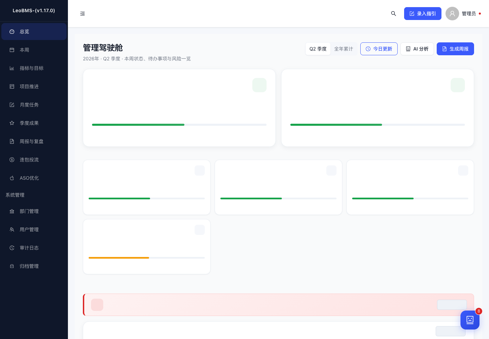
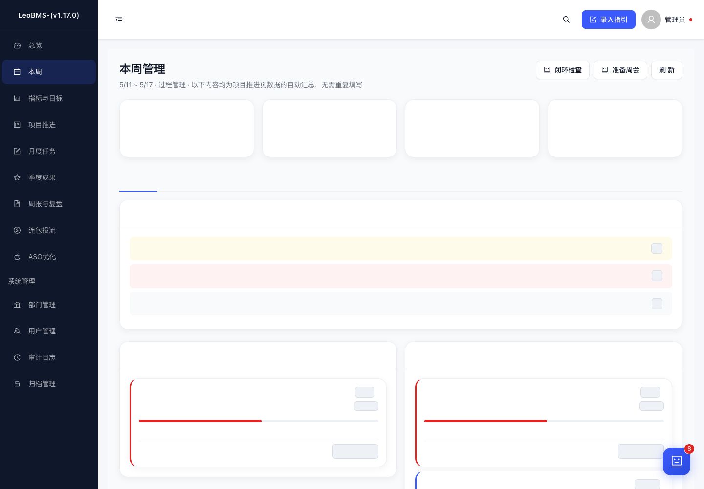
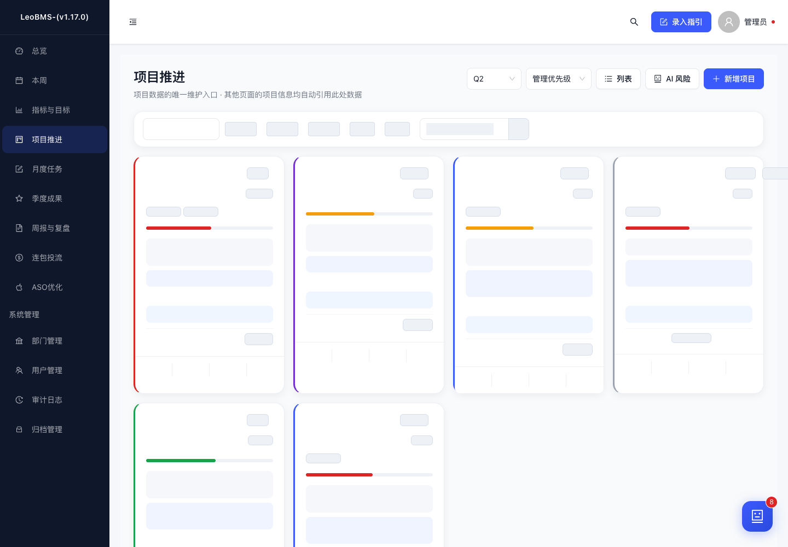

# 增长组业务管理系统

> 专为增长组设计的业务数据管理 Web 系统，支持五大业务模块管理、可视化仪表盘、智能周报生成和数据导入导出。

## 系统截图

<table>
  <tr>
    <td align="center"><b>管理驾驶舱</b></td>
    <td align="center"><b>周管理</b></td>
    <td align="center"><b>重点工作</b></td>
  </tr>
  <tr>
    <td></td>
    <td></td>
    <td></td>
  </tr>
</table>

## 技术栈

- **前端**：React 18 + Ant Design 5 + ECharts 5 + html-to-image
- **后端**：Node.js + Express 4 + Sequelize ORM + DeepSeek LLM
- **数据库**：PostgreSQL 14+ / SQLite（本地开发 + 生产）
- **认证**：JWT + bcrypt + token_version 校验
- **AI**：DeepSeek Chat + 规则引擎混合架构 + SSE 流式输出
- **部署**：Docker + Docker Compose / 本地 Mac + Cloudflare Tunnel

## 快速开始

### 方式一：Docker 一键部署（推荐）

```bash
# 1. 克隆项目
cd growth-system

# 2. 启动所有服务（PostgreSQL + 后端 + 前端 Nginx）
docker-compose up -d

# 3. 查看服务状态
docker-compose ps

# 4. 访问系统
# 前端：http://localhost
# 后端 API：http://localhost:3001
# 健康检查：http://localhost:3001/health
```

### 方式二：本地开发

#### 一键启动（推荐 · 前后端同端口 3001）

```bash
# 1. 安装依赖
cd backend && npm install && cd ../frontend && npm install

# 2. 构建前端
cd frontend && npm run build

# 3. 一键启动（后端托管前端静态文件 + API，同端口 3001）
./start.sh

# 4. 访问 http://localhost:3001
# 外网：配合 cloudflared tunnel --url http://localhost:3001
```

> **架构说明**：后端 Express 同时托管前端 build 产物和 API，SPA 路由回退到 index.html，无需额外代理或 serve 进程。

#### 前后端分离开发模式

##### 后端启动

```bash
cd backend

# 安装依赖
npm install

# 配置环境变量（可选，默认连接本地 PostgreSQL）
export DB_HOST=localhost
export DB_PORT=5432
export DB_NAME=growth_system
export DB_USER=growth
export DB_PASSWORD=growth123
export JWT_SECRET=growth-secret-key-2026
export JWT_EXPIRES_IN=7d

# 使用 SQLite 模式（无需 PostgreSQL）
export DB_DIALECT=sqlite
npm run dev
```

#### 前端启动

```bash
cd frontend

# 安装依赖
npm install

# 启动开发服务器
npm start

# 访问 http://localhost:3000
```

#### 数据库初始化

系统首次启动时会自动同步表结构。如需手动初始化数据：

```bash
# 连接 PostgreSQL 后执行 init.sql
psql -U growth -d growth_system -f backend/init.sql
```

## 测试账号

| 账号 | 密码 | 角色 | 权限 |
|------|------|------|------|
| admin | 123456 | 管理员 | 全量数据读写、用户管理、系统配置 |
| expand | 123456 | 部门账号 | 仅可录入/修改拓展组数据 |
| ops | 123456 | 部门账号 | 仅可录入/修改运营组数据 |

## 项目结构

```
growth-system/
├── start.sh                    # 一键启动脚本（DB_DIALECT=sqlite + 前后端同端口）[v3.2]
├── start-prod.sh               # 生产启动脚本（pm2 + 环境变量）[v6.1]
├── docker-compose.yml          # Docker 编排配置
├── backend/                    # 后端服务
│   ├── Dockerfile
│   ├── package.json
│   ├── growth_system.sqlite   # SQLite 数据库（本地开发）[v3.2]
│   ├── init.sql               # 数据库初始化脚本
│   ├── backup.sh              # 自动备份脚本 [v6.1]
│   ├── config/
│   │   └── database.js        # 数据库配置（支持 PostgreSQL / SQLite 切换）
│   └── src/
│       ├── app.js             # 应用入口（含前端静态托管 + SPA回退）[v3.2]
│       ├── routes/            # 路由配置
│       │   └── fileRoutes.js  # 文件鉴权下载路由 [v6.1]
│       ├── models/            # Sequelize 数据模型（5表 paranoid 软删除）[v6.1]
│       ├── controllers/       # 业务控制器
│       ├── services/          # 业务服务（周报生成、定时任务）
│       ├── middleware/        # 中间件（认证、权限、限流）
│       ├── utils/             # 工具函数
│       └── ai/                # AI 助手模块 [v6.0]
│           ├── controllers/   # AI 控制器（含 SSE streamChat）[v6.1]
│           ├── services/      # LLM Provider / 编排器 / 上下文服务
│           ├── routes/        # AI 路由
│           └── utils/         # promptSecurity / aiOutputParser / aiFormatters [v6.1]
├── frontend/                   # 前端应用
│   ├── Dockerfile
│   ├── package.json
│   ├── nginx.conf             # Nginx 配置
│   └── src/
│       ├── App.js             # 路由配置（React.lazy 懒加载）[v6.1]
│       ├── index.js           # 入口文件
│       ├── index.css          # Design Token CSS 变量体系 [v6.1]
│       ├── hooks/             # 自定义 Hooks（useAuth / useSubmitGuard / useAIStream）[v6.1]
│       ├── utils/             # 工具函数
│       │   └── constants.js   # 统一状态色/进度色/样式常量 [v3.0]
│       ├── components/        # 公共组件
│       │   ├── ErrorBoundary.js  # 错误边界（全局+每页）[v6.1]
│       │   └── AsyncState.js     # 统一异步状态组件 [v6.1]
│       └── pages/             # 页面组件
│           ├── DashboardPage.js      # 管理首页（今日提醒+本周关注+重点推进+长期未更新）[v3.2重构]
│           ├── KpiPage.js            # 核心指标（含业务线业绩表）[v3.0增强]
│           ├── ProjectPage.js        # 重点工作（今日更新+行内编辑+快速更新+优先排序）[v3.2增强]
│           ├── WeekPage.js           # 周管理页（本周概览/今日更新/下周重点）[v3.0新增]
│           ├── SettlementPage.js     # 沉淀页（月度+季度统一视图）[v3.0新增]
│           ├── PerformancePage.js    # 业务线业绩
│           ├── MonthlyTaskPage.js    # 月度工作
│           ├── AchievementPage.js    # 季度成果
│           ├── WeeklyReportPage.js   # 周报管理（含结论+关键变化）[v3.0增强]
│           ├── ImportPage.js         # 数据导入
│           └── UserPage.js           # 用户管理
└── README.md
```

## 核心功能

### 1. 五大业务模块

| 模块 | 对应表 | 核心功能 |
|------|--------|----------|
| A - 核心指标 | kpis | 按部门×季度管理 GMV/净利润，后端硬计算完成率 |
| B - 重点工作 | projects | 项目追踪、进度可视化、风险标红、严重预警、行内编辑、管理优先排序 [v3.0] |
| C - 业务线业绩 | performances | Q1-Q4 目标/完成追踪、后端硬计算预警状态 |
| D - 月度工作 | monthly_tasks | 按月筛选、完成度追踪、下月跟进 |
| E - 季度成果 | achievements | 成果沉淀、跨季度复用、优先级筛选 |

### 2. 管理驾驶舱（Dashboard）[v3.2 重构]

- **今日变化 + 本周关注**：双栏管理信息流，驱动行动而非仅展示数据
- **KPI 卡片**：当前季度两部门 GMV 完成率、净利润完成率、风险项目数
- **重点推进事项**：自动筛选风险/临期/低进度项目
- **长期未更新项目**：7/10/14天分级提醒
- **今日更新 Drawer**：从驾驶舱弹出，查看变更流 + 待更新项目 + 快捷录入入口（更新操作引导至项目推进页）
- **图表区**：工作状态分布饼图、快捷操作面板

### 3. 周+日双节奏管理 [v3.2 更新]

- **周管理页**（/week）：三 Tab 架构
  - 📋 本周概览：本周关注点、风险项目、临期项目、全部项目进度
  - 📝 今日更新：当日变化流、3天未更新预警、今日到期提醒
  - ⚡ 下周重点：下周到期项目、需关注项目
- **今日更新机制** [v3.2 重构]：
  - 每个项目卡片新增"今日更新"操作按钮，打开增强版更新 Drawer
  - 增强版更新支持：📊进度 + 🏷️状态 + 📝本周进展 + ⚠️风险与问题（一键保存写回项目表）
  - Dashboard 的今日更新 Drawer 聚焦"变更展示"，更新操作引导至项目推进页
  - 数据闭环：今日更新 → 写入项目表 → AuditLog 自动记录 → Dashboard 变更流展示

### 4. 智能周报生成 [v3.0 增强]

**触发方式**：
- 手动：仪表盘点击"生成周报"按钮
- 自动：每周五 18:00 自动生成周报草稿（node-cron）

**周报内容**：
1. **本周结论** [v3.0]：规则驱动自动生成，涵盖 KPI 完成率、风险项、预警状态
2. **关键变化** [v3.0]：风险状态变化、高进度项目、KPI 偏差/达成
3. 本周数据摘要（KPI 完成率对比）
4. 重点工作进展（本周更新项目清单）
5. 风险与预警（风险项目 + 严重预警指标）
6. 下周焦点（即将到期项目 + 下月跟进事项）
7. 新增成果（本周新增/更新成果记录）

### 5. 统一状态与交互体系 [v3.0]

- **状态色统一**：`utils/constants.js` 全局共享（进行中=蓝/完成=绿/风险=红/未启动=灰）
- **进度色规则**：≥80% 绿 / ≥60% 黄 / <60% 红
- **逾期标签**：逾期(红) / 临期(橙) / 剩余天数(灰)
- **管理优先排序**：风险 > 临期 > 低进度 > 其他
- **沉淀页**（/settlement）：月度工作 + 季度成果统一视图

- **Excel 导入**：支持从现有"部门追踪总表.xlsx"一键导入，自动识别 5 个 Sheet
- **Excel 导出**：按模块导出数据，包含后端计算的完成率和预警状态
- **PDF 导出**：按季度导出周报 PDF

## API 文档

### 认证
- `POST /api/auth/login` - 登录
- `GET /api/auth/me` - 获取当前用户
- `POST /api/auth/change-password` - 修改密码

### 用户管理（管理员）
- `GET /api/users` - 用户列表
- `POST /api/users` - 创建用户
- `PUT /api/users/:id` - 更新用户
- `DELETE /api/users/:id` - 删除用户

### 核心指标
- `GET /api/kpis?quarter=Q1&year=2026` - KPI 列表
- `GET /api/kpis/dashboard` - 仪表盘 KPI 数据
- `POST /api/kpis` - 创建 KPI
- `PUT /api/kpis/:id` - 更新 KPI
- `DELETE /api/kpis/:id` - 删除 KPI

### 重点工作
- `GET /api/projects?quarter=Q1&status=进行中&sort=priority` - 项目列表（sort=priority 管理优先排序 [v3.0]）
- `GET /api/projects/dashboard` - 项目统计
- `GET /api/projects/stale?days=7` - 长期未更新项目 [v3.2]
- `POST /api/projects` - 创建项目
- `PUT /api/projects/:id` - 更新项目
- `PUT /api/projects/:id/quick-update` - 今日更新（进展+进度+状态+风险）[v3.2]
- `DELETE /api/projects/:id` - 删除项目

### 业务线业绩
- `GET /api/performances` - 业绩列表
- `GET /api/performances/dashboard` - 业绩统计
- `POST /api/performances` - 创建业绩
- `PUT /api/performances/:id` - 更新业绩
- `DELETE /api/performances/:id` - 删除业绩

### 月度工作
- `GET /api/monthly-tasks?month=2026-04` - 月度工作列表
- `POST /api/monthly-tasks` - 创建月度工作
- `PUT /api/monthly-tasks/:id` - 更新月度工作
- `DELETE /api/monthly-tasks/:id` - 删除月度工作

### 季度成果
- `GET /api/achievements?quarter=Q1&priority=高` - 成果列表
- `POST /api/achievements` - 创建成果
- `PUT /api/achievements/:id` - 更新成果
- `DELETE /api/achievements/:id` - 删除成果

### 仪表盘
- `GET /api/dashboard?mode=quarter|year` - 综合仪表盘数据
- `GET /api/dashboard/today-changes` - 今日数据变更列表 [v3.2]
- `GET /api/dashboard/week-focus` - 本周关注点（规则驱动）[v3.2]
- `GET /api/dashboard/week-summary` - 本周摘要统计 [v3.2]

### AI 助手
- `POST /api/ai/panel` — 获取面板数据
- `POST /api/ai/analyze` — AI 分析
- `POST /api/ai/chat` — 自由问答
- `POST /api/ai/chat-stream` — 流式自由问答（SSE）
- `POST /api/ai/briefing` — 生成简报
- `GET /api/ai/badge-summary` — 角标摘要

### 文件下载（鉴权）
- `GET /api/files/exports/:filename` — 下载导出文件（需 export.data 权限）
- `GET /api/files/weekly-reports/:filename` — 下载周报文件（需 weekly_report.read 权限）

### 周报
- `POST /api/weekly-reports/generate` - 生成周报
- `GET /api/weekly-reports` - 周报列表
- `GET /api/weekly-reports/latest` - 最新周报
- `GET /api/weekly-reports/:id` - 周报详情
- `PUT /api/weekly-reports/:id/html` - 保存 HTML 内容
- `PUT /api/weekly-reports/:id/files` - 保存文件链接

### 导入导出
- `POST /api/import/excel` - 导入 Excel（multipart/form-data）
- `GET /api/export/:module` - 导出模块数据（module: kpis/projects/performances/monthly-tasks/achievements）

### 统一响应格式

```json
{
  "code": 0,      // 0=成功，非0=失败
  "data": {},     // 响应数据
  "message": ""   // 提示信息
}
```

## 数据库表结构

| 表名 | 说明 |
|------|------|
| departments | 部门表（拓展组、运营组） |
| users | 用户表（管理员/部门账号） |
| kpis | A表：核心指标 |
| projects | B表：重点工作追踪（支持今日更新 quick-update） |
| performances | C表：业务线业绩追踪 |
| monthly_tasks | D表：月度重点工作 |
| achievements | E表：季度成果沉淀 |
| weekly_reports | 周报表 |
| audit_logs | 审计日志（今日变更流数据源） |
| quarter_archives | 季度归档 |

## 部署到 Ubuntu 服务器

```bash
# 1. 将项目上传到服务器
scp -r growth-system user@VM-1-48-ubuntu:/opt/

# 2. 服务器上执行
cd /opt/growth-system
docker-compose up -d

# 3. 查看日志
docker-compose logs -f backend
docker-compose logs -f frontend

# 4. 更新部署
docker-compose down
git pull  # 或上传新版本
docker-compose up -d --build
```

## 注意事项

1. **生产环境部署前**：
   - 修改 `JWT_SECRET` 为强密码
   - 修改数据库密码
   - 关闭 `sequelize.sync({ alter: true })`，改用迁移脚本
   - 配置 HTTPS

2. **数据备份**：
   ```bash
   # 备份数据库
   docker exec growth-db pg_dump -U growth growth_system > backup.sql
   
   # 恢复数据库
   docker exec -i growth-db psql -U growth growth_system < backup.sql
   ```

3. **周报 PNG 生成**：
   - 使用 html-to-image 在前端生成，宽度固定 1200px
   - 如需服务端生成，可配置 puppeteer（已包含在依赖中）

## 版本更新日志

### v6.1.0 — 2026-04-25 · 安全加固 + 体验升级

> 核心改动：3 波 18 项安全与体验升级，覆盖认证防护、数据安全、AI 输出标准化、前端性能优化。

**Wave 1 — 安全加固（4 项）**
- SQLite PRAGMA 加固：WAL + synchronous=NORMAL + busy_timeout=5000 + wal_autocheckpoint
- 自动备份脚本 backup.sh + crontab（每日 2:00 / 每周日 3:00，7 天 daily + 4 周 weekly）
- 限流细化：登录 5 次/分 + AI 20 次/分 + 导入 10 次/分
- AI Prompt 注入防护：promptSecurity.js（13 条规则）+ 用户输入隔离 + 系统指令加固

**Wave 2 — 认证与数据安全（8 项）**
- User Model 加 token_version：修改密码递增，旧 token 自动失效
- authenticate 中间件：DB 失败返回 503（不降级）+ token_version 校验 + pending 状态拦截
- import 事务包裹：sequelize.transaction 保证导入原子性
- 导出文件鉴权：`/uploads` 和 `/weekly-reports` 不再静态暴露，改为 `/api/files/` 鉴权下载
- 前端 ErrorBoundary：全局 + 每页包裹，单页崩溃不影响其他页面
- 软删除：5 个业务表 paranoid + Department status 字段 + User 软删除=disabled
- getRecordHistory 权限补丁：需 audit.read 权限

**Wave 3 — 体验升级（6 项）**
- Design Token 补全：8 级字号 / 间距 / Z-index / 动画 + 语义色 light 变体
- 代码分割：React.lazy + Suspense 懒加载 15 个页面，首屏按需加载
- useSubmitGuard hook：防重复提交，支持 cooldown 冷却期
- AI 输出标准化：aiOutputParser.js（JSON 提取 + 纯文本解析 + 置信度 + Markdown 清理）
- AsyncState 组件：统一 loading/error/empty/data 四种状态
- AI 流式输出 SSE：后端 callStream + streamChat 路由 + 前端 useAIStream hook

**SQLite 新增列**
- `users.token_version` / `departments.status` / `kpis/projects/performances/monthly_tasks/achievements.deleted_at`

---

### v6.0.0 — 2026-04-24 · AI 智能助手上线

> 核心改动：全页面 AI 副驾驶，4 种分析模式，DeepSeek LLM 接入，Mock Fallback 保障。

**AI 助手模块**
- 后端 16 个新文件（`backend/src/ai/`）：控制器/路由/编排器/上下文服务/6 个子服务/LLM Provider/Mock Provider/3 个工具
- 前端 10 个新文件（`components/ai/` + `hooks/` + `services/`）：悬浮按钮/助手栏/Tab 头部/洞察卡片/动作列表/聊天输入/空状态
- 4 种分析模式：今日判断 / 风险与闭环 / 汇报与周会 / 自由问答
- 规则+LLM 混合架构：风险/闭环用规则引擎先提炼，LLM 再润色
- Mock Fallback：无 LLM Key 时自动降级，系统不崩

**页面接入**
- Dashboard：AI 分析按钮
- Week：闭环检查 + 准备周会
- Projects：AI 风险分析
- WeeklyReports：AI 简报 + 周会议程

**AI API**
- `POST /api/ai/panel` — 获取面板数据
- `POST /api/ai/analyze` — AI 分析
- `POST /api/ai/chat` — 自由问答
- `POST /api/ai/briefing` — 生成简报
- `GET /api/ai/badge-summary` — 角标摘要

**环境变量**
- `AI_LLM_PROVIDER` / `AI_LLM_API_KEY` / `AI_LLM_MODEL` / `AI_LLM_BASE_URL`
- 当前配置：DeepSeek V4 Flash（deepseek-v4-flash）

---

### v5.1.0 — 2026-04-24 · 时间进度逻辑升级

> 核心改动：用时间进度替代硬阈值判断，解决季度初期正常指标被误判"落后"的问题。

**时间进度计算**
- 新建 `timeProgress.js` 工具，计算季度/年度时间进度百分比
- 完成率 vs 时间进度 ±5% 判断：超前(>tp+5%) / 正常(±5%内) / 落后(<tp-5%)
- 影响：后端 6 个 controller + 1 个 service + 前端 5 个页面 + 1 个工具文件，共 14 文件

**附加修复**
- auth.js 中 super_admin 未被识别为 roleLevel=0 的 bug 修复

---

### v5.0.0 — 2026-04-23 · 部门动态化 + 字段合并 + 草稿 + 同步选项

> 核心改动：部门从硬编码升级为动态 CRUD；"阻塞中"合入"风险"；新增项目草稿功能；项目同步到月度/季度。

**12 项全部完成**
- 部门动态化：后端 CRUD API + 前端 DepartmentSelect 组件 + Dashboard 动态化
- 字段合并：block_reason 合入 next_action，"阻塞中"状态合入"风险"
- 每日更新追加：weekly_progress 自动追加 [MM/DD] 标记
- 同步选项：sync_to_monthly / sync_to_achievement — 在新增/编辑项目 Modal 中勾选
- 个人数据权限：MonthlyTask/Achievement 的 update/delete 加 creator_id 校验
- 删除确认：7 个页面全部加 Popconfirm
- 部门管理页面：/departments 路由，系统管理菜单新增入口
- 权限矩阵新增：department.read/create/update/delete

---

### v4.4.0 — 2026-04-24 · 权限隔离加固

> 核心改动：全量权限审计，修复跨部门数据泄露，9 个权限漏洞全部堵上。

**P0 — dashboardController 跨部门数据泄露（根因修复）**
- `Department.findAll()` 无条件取所有部门 → 加 `scopeDeptId` 过滤
- 影响面：KPI 卡片/偏差检测/汇总计算/季度对比图 6 个数据点全部泄露

**MEDIUM — importController 缺少 applyDataScope**
- 导入路由缺 `applyDataScope` 中间件 → 已补上
- `Department.findAll()` 无条件取所有部门 → 加 `scopeDeptId` 过滤

**MEDIUM — weeklyReportController has_dept_data 字段泄露**
- 列表接口返回 `has_dept_data` 暴露其他部门是否有数据 → 移除

**LOW — 查询接口 dept_id 静默覆盖 → 403 拒绝**
- project/performance/monthlyTask/achievement 4 个列表接口
- 旧逻辑：用户传 `?dept_id=2` 被静默替换为 `req.deptFilter=1`
- 新逻辑：冲突时返回 403 "无权查看其他部门数据"

**LOW — 更新接口 dept_id 跨部门修改校验**
- 5 个 update 接口（project/kpi/performance/monthlyTask/achievement）
- 新 `dept_id` 不在权限范围内时返回 403 "无权将数据转移到其他部门"

**其他修复（同日）**
- 首页数据权限：dashboardController 3 处查询漏了 deptFilter（dueThisWeek/staleProjects/todayChanges）
- 编辑项目白屏防御：handleEdit 从 `{...record}` 全展开改为字段白名单 + safeMoment() + boolean 强转
- 项目草稿功能：localStorage 自动保存/恢复/清除
- AI 环境变量：.env 补 DeepSeek 真通道配置
- SQLITE_READONLY 根治：pm2 必须用 delete+start，database.js 绝对路径 + 显式写权限声明

---

### v4.3.0 — 2026-04-22 · V4 上线加固收尾

> 核心改动：SQLite 兼容修复、数据权限全量落地、字段白名单加固、前端 owner 自动填充。

**P0 — SQLite 兼容修复**
- Project 模型新增 `year` 字段，SQLite 同步 ALTER TABLE，解决 Dashboard 查询报错
- 全仓库 `Op.iLike` → `Op.like`（SQLite 不支持 ILIKE），覆盖 searchController/projectController/achievementController
- JSONB/ENUM 类型排查确认：Sequelize 自动映射，无兼容问题

**P0 — 数据权限全量落地**
- MonthlyTask/Achievement controller 新增 `self` 范围过滤（department_member 只能看自己负责/创建的）
- Export controller 新增 `deptFilter` 过滤，防止越权导出全量数据
- 6 个 controller（monthlyTask/achievement/performance/kpi/project/search）create/update 全部加字段白名单，禁止任意字段直传

**P1 — 上线验收**
- 14 项 API Smoke Test 全部通过（admin + dept 账号双验证）
- README 运行说明真实性校验通过（3 个测试账号可登录、start.sh 可用、Docker 配置完整）
- 周报部门隔离已验证（deptFilter 在 generate/get/filter 三处生效）

**P1 — 高风险接口修复**
- 前端项目创建自动填充 `owner_user_id`（从当前登录用户），确保后端角色过滤可匹配
- Export 越权已修复（加 deptFilter）
- 周报隔离已确认（deptFilter 在 controller 中正确使用）

---

### v4.2.0 — 2026-04-22 · 角色化仪表盘 + 项目看板 + 季度回退 + 审计覆盖

> 核心改动：仪表盘按角色分视图；项目页新增看板模式与闭环字段；空季度自动回退；审计日志全量覆盖。

**角色化仪表盘（Role-based Dashboard）**
- 三角色三视图：super_admin → 管理驾驶舱、department_manager → 部门仪表盘、department_member → 我的工作台
- 成员视图（我的工作台）：4 个个人 KPI 卡片（我的项目/风险/临期/已完成）、我的项目列表+快捷更新、我的待办面板、快捷入口网格、精简版今日更新 Drawer
- 管理端视图：周报生成按钮增加 `can(role, 'weekly_report.generate')` 权限守卫

**季度回退逻辑（Quarter Fallback）**
- 当 mode=quarter 时，后端检测当前季度是否有数据（Project + Kpi 计数）
- 若当前季度为空，自动从 Q4→Q1 回溯，找到最近有数据的季度
- 所有后续查询使用 effectiveQuarter，前端展示黄色提示条告知用户回退到哪个季度
- 响应新增 `effective_quarter` 和 `quarter_fallback` 字段

**项目看板视图 + 闭环字段**
- 项目页视图模式从 2 种升级为 3 种：卡片 / 表格 / **看板**
- 看板视图：6 列（未启动 / 进行中 / 合作中 / 阻塞中 / 风险 / 完成），彩色列头，卡片展示优先级/下一步/需决策/阻塞原因
- 闭环字段新增：`priority`（高/中/低）、`next_action`（下一步动作）、`decision_needed`（是否需决策）、`block_reason`（阻塞原因）
- 卡片视图同步展示：优先级标签🔥、需决策标签⚡、下一步蓝色块、阻塞原因红色块
- 项目详情 Drawer / 编辑 Modal / 今日更新 Drawer 全量适配闭环字段
- 后端 quick-update allowedFields 补齐 `block_reason`

**审计日志覆盖**
- 用户 CRUD + 修改密码全部接入 `logAudit`
- createUser / updateUser / deleteUser：操作前后值对比记录
- changePassword：记录 `{ change_password: true }`
- 至此，所有核心业务模块的增删改操作均已审计覆盖

**上线准备**
- 新增 `docs/V4-launch-checklist.md`：P0(8项)/P1(6项)/P2(5项)/安全(6项) 验收清单
- 含 SQLite 迁移 SQL 模板，上线前逐项核对

---

### v4.1.0 — 2026-04-22 · 周报部门权限隔离 + 年度指标独立录入 + 入口更名

> 核心改动：周报数据按部门权限严格隔离；年度指标录入从共用 Modal 升级为独立弹窗；右上角入口更名。

**周报部门权限隔离**
- 周报 API 路由全量加 `requireDeptAccess` 中间件（之前缺失，导致跨部门数据可见）
- `generateWeeklyReportData` 增加 `deptFilter` 参数，KPI/项目/风险/成果等查询按 `dept_id` 过滤
- `getLatestReport`/`getReportById` 对返回的 `content_json` 做部门级内容过滤
- 新增 `filterReportContentForDept` 辅助函数：按部门名过滤 kpi_summary/project_progress/risk_and_warnings/next_week_focus/new_achievements
- 周报导出使用后端已过滤数据，天然部门隔离

**年度指标独立录入**
- 年度指标 Tab 新增独立「年度指标录入」Modal（之前共用核心指标 Modal，quarter 必填导致点击无反应）
- 表单直接填写 Q1-Q4 目标与完成值，提交时自动创建4条 KPI 记录
- 按钮 renamed 为「新增年度指标」

**入口更名**
- 右上角「数据录入」按钮改名为「录入指引」

---

### v4.0.0-P1 — 2026-04-22 · 项目收口 + 状态升级 + 每日更新日志

> 核心改动：项目录入只做项目，月度/季度字段彻底拆出；项目状态 4→6；新增项目每日内容更新日志表。

**项目录入做减法**
- Project model 删除 `monthly_progress`、`quarterly_progress` 字段
- 项目表单、数据录入页、导入/导出模板同步移除月度/季度字段
- 项目录入不再承载月度/季度角色，项目就是项目

**项目状态 4→6**
- 新增：`合作中`（跨部门/外部协同）、`阻塞中`（资源/依赖/审批暂停）
- 完整状态集：未启动 / 进行中 / 合作中 / 阻塞中 / 风险 / 完成
- 后端枚举、前端 STATUS_COLORS、统计接口、导入校验全量适配

**项目每日更新日志（ProjectUpdateLog）**
- 新增独立表 `project_update_logs`，记录项目每日内容更新（进展、状态、进度、风险）
- `quick-update` 接口每次更新自动写日志，支持按日期追溯
- 明确区分：每日更新 = 项目内容变更记录；AuditLog = 操作审计日志

**数据归属字段补齐**
- Project / MonthlyTask / Achievement 新增 `creator_id`、`updater_id`
- 创建/更新接口自动写入操作人，为权限分层打基础

**接口安全加固**
- Project create/update 增加字段白名单，禁止任意字段直传
- import 状态校验适配 6 个新状态

---

### v3.3.0 — 2026-04-22 · 移动端基础适配 [A方案]

> 核心改动：引入响应式断点检测，解决手机访问时侧边栏占满屏幕、表格溢出、按钮拥挤等问题。

**Layout 响应式重构**
- 引入 `Grid.useBreakpoint()` 检测屏幕宽度（`< 768px` 视为移动端）
- 移动端隐藏固定侧边栏，Header 左侧出现汉堡菜单按钮，点击打开 Drawer 菜单
- 桌面端保持原有侧边栏 + 折叠按钮，体验不变
- Content 区域的 margin/padding 随屏幕自适应（手机 8/12px，桌面 24px）
- Header 数据录入按钮在手机上精简为"录入"，节省空间

**表格横向滚动**
- 全站 8 个页面的 Ant Design Table 统一添加 `scroll={{ x: 'max-content' }}`
- 覆盖页面：项目推进、指标与目标、业务线业绩、月度任务、季度成果、用户管理、审计日志、导入结果
- 小屏下表格支持横向滑动，避免列被截断

**项目卡片操作收敛**
- 移动端：项目卡片底部操作栏从 4 个图标收敛为 3 个（查看 / 今日更新 / 更多）
- "更多" Dropdown 收起编辑和删除，避免小屏拥挤
- 桌面端保持原有 4 个图标不变

---

### v3.2.0 — 2026-04-22 · 部署架构统一 + 今日更新闭环

> 核心改动：前后端同端口部署消除代理问题，"今日更新"从只读展示升级为可操作闭环。

**部署架构重构**
- 后端 Express 直接托管前端 build 产物 + SPA 回退，前后端统一在 3001 端口
- 删除独立的 `serve` 进程（原 3456 端口），消除跨端口 API 代理问题
- 新增 `start.sh` 一键启动脚本（DB_DIALECT=sqlite，无需 PostgreSQL）
- 支持 SQLite 本地开发模式（`DB_DIALECT=sqlite` 环境变量切换）
- CORS 配置兼容本地开发端口

**今日更新逻辑重构**
- 项目卡片操作栏新增「今日更新」按钮（📝 图标），一键打开增强版更新 Drawer
- 增强版更新 Drawer 支持 4 个字段同时编辑：
  - 📊 进度（可视化进度条 + 数字输入）
  - 🏷️ 状态（下拉选择：未启动/进行中/风险/完成）
  - 📝 本周进展（文本编辑）
  - ⚠️ 风险与问题（文本编辑）
- Dashboard 今日更新 Drawer 精简：删除旧的简易快速更新 Drawer，聚焦变更展示
- "待更新项目"区域的按钮改为"前往更新"，引导至项目推进页做完整更新
- 数据闭环：今日更新 → 写入项目表 → AuditLog 自动记录 → Dashboard 变更流展示

**Bug 修复**
- 修复仪表盘数据加载失败：前端 build 产物通过 serve 托管时无法代理 `/api` 请求到后端，导致所有 API 返回 HTML 而非 JSON

---

### v3.1.0 — 2026-04-22 · 结构收敛型优化

> 从"功能堆叠"收敛为"信息归属清晰、入口唯一、节奏明确"的管理工作台。

**导航与入口重构**
- 右上角新增显性「数据录入」按钮（下拉快捷入口：项目/指标/月度/成果），始终可见
- 左侧导航重排：总览 → 今日更新 → 本周管理 → 项目推进 → 指标与目标 → 月度任务 → 季度成果 → 周报与复盘
- 新增「今日更新」独立一级页面（/today），从 WeekPage 中抽出
- 数据录入不再隐藏在下拉菜单，从头像下拉中移除

**首页总览改版**
- 从"内容拼盘"重构为"管理首页"：今日提醒 → 本周关注 → 重点推进事项 → 长期未更新项目 → 风险摘要 → 快捷操作
- 删除首页重复的"高风险项目表格"和"7天内到期表格"，改为紧凑卡片
- 新增"长期未更新项目"区块（7/10/14天分级提醒，替代对长周期项目误用"7天内到期"）
- 新增"快捷操作"区块，标注每个模块的定位（唯一维护入口/自动汇总/结果输出）

**信息归属收敛**
- 项目推进页明确标注为"唯一维护入口"，其他页面的项目信息均为自动引用
- 本周管理页标注"过程管理 · 自动汇总，无需重复填写"
- 周报与复盘页标注"结果输出页 · 自动生成，只需补充管理评语"
- 今日更新页定位为"日更新节奏 · 变更聚合与提醒入口"

**长周期项目提醒**
- 项目卡片增加"7/10/14天未更新"分级标签（🚨⚠💤），替代仅用"7天内到期"
- 短周期事项继续用到期提醒，长周期项目改用"未更新天数"提醒

**自动/手动标识增强**
- 周报结论标注"自动生成"Tag
- 周报页脚区分"自动汇总"与"需手动补充"
- 各页面 subtitle 中明确标注数据来源和维护方式

---

### v3.0.0 — 2026-04-22 · 管理导向工作台升级

> 从"模块化数据后台"升级为"面向管理动作的团队业务工作台"，核心转变：**管理视角 > 表格视角**。

**P0 — 基础架构升级**
- 新增 `utils/constants.js`：统一状态色（STATUS_COLORS）、进度色（getProgressColor）、状态样式（getStatusStyle），全局共享
- Dashboard 新增「今日变化 + 本周关注」双栏管理驾驶舱，信息流从"看数据"转向"做决策"
- 重点工作页增强：逾期/临期/剩余天数标签、本周进展摘要、快速更新抽屉、行内进度编辑、管理优先排序（风险>临期>低进度>其他）
- 周报新增「本周结论」+「关键变化」模块，规则驱动自动生成，不再只是数据搬运

**P1 — 页面体系重构**
- 新增 `WeekPage.js`（/week）：周管理页，三 Tab 架构——📋本周概览 / 📝今日更新 / ⚡下周重点
- 新增 `SettlementPage.js`（/settlement）：沉淀页，月度工作+季度成果统一视图
- 侧边栏层级调整：管理动作优先（周管理 > Dashboard > 重点工作），数据入口降级
- 重点工作详情增强：风险/临期/严重预警状态标记行、最后更新时间显示

**P2 — 逻辑与体验统一**
- 重点工作排序支持切换：管理优先 / 时间排序
- 周报结论生成逻辑：KPI完成率判断 + 风险项统计 + 严重预警识别 + 更新活跃度
- 关键变化提取：风险状态变化 + 高进度项 + KPI 偏差/达成
- 后端 projectController 支持 sort=priority 参数

**核心设计原则**
- 周+日双节奏管理：周管理定方向，日更新追执行
- 信息架构重组：管理视角 > 表格视角，行动导向 > 数据堆砌
- 兼容增量升级：不删除任何已有路由/页面/API，只做叠加和增强
- 规则驱动 > AI 生成：周报结论基于规则引擎，稳定可控

---

### v2.0.0 — 2026-04-21 · 保守型 UI 升级

> 从"标准 AntD 管理后台"提升为"克制专业的增长业务系统"，不破坏任何业务功能。

**阶段1：统一视觉基线**
- 新增 `src/theme/index.js`，集中管理 AntD token（主色 #3B5AFB、圆角 14、深色侧边栏等）
- ConfigProvider 接入 theme，全局生效
- 全局 CSS 变量体系（--app-bg / --text-1 / --shadow-soft 等）+ 公共 class（surface-card / metric-value / hover-lift 等）

**阶段2：抽取公共骨架组件**
- 新增 `PageHeader` — 统一页面头部（标题+副标题+操作区）
- 新增 `PanelCard` — 统一面板卡片容器
- 新增 `MetricCard` — 统一指标卡片（数值+状态+趋势）

**阶段3：Dashboard 驾驶舱化**
- 页面头部改为 PageHeader 摘要式
- KPI 卡片去掉高饱和渐变，改白底+状态色点缀
- 图表区用 PanelCard 包裹，移除低价值雷达图
- 列表区改为行动导向（高风险项目 / 7天内到期 / 最近动态）

**阶段4：重点工作页产品化**
- 统一 STATUS_COLORS 状态色映射（进行中=蓝 / 已完成=绿 / 风险=红 / 待开始=灰）
- 卡片精简，只突出项目名/负责人/状态/截止时间/核心进度
- surface-card + hover-lift 公共样式

**阶段5：周报页展示提档**
- 新增摘要卡片行（本周成果数 / 高风险数 / 下周重点数）
- KPI 卡片用 surface-card 统一风格
- 导出按钮统一尺寸和间距

**阶段6：登录页轻量提档**
- 左右分栏布局：左侧深色品牌区 + 产品亮点，右侧白底登录表单
- 品牌文案：增长业务管理系统 / 统一管理目标、项目、业绩与周报沉淀

**其他改动**（同期）
- 核心指标仪表盘重叠修复：拆为独立卡片网格，按指标分组独立 Y 轴
- 重点工作合并下周重点：Tab 切换本周/下周，侧边栏精简

---

### v1.0.0 — 2026-04-21 · 完整功能首版

> 增长组业务管理系统初始版本，五大业务模块全功能上线。

**核心功能**
- 五大业务模块 CRUD：核心指标(A) / 重点工作(B) / 业务线业绩(C) / 月度工作(D) / 季度成果(E)
- 可视化仪表盘：KPI 卡片 + 柱状图 + 饼图 + 雷达图
- 智能周报生成：手动触发 + 每周五 18:00 自动生成，支持 HTML / PNG / Word / Markdown 导出
- Excel 导入导出：从部门追踪总表一键导入，按模块导出
- 用户权限管理：管理员 / 部门账号二级权限
- 季度归档 + 审计日志 + 数据版本对比
- Docker + Docker Compose 部署方案

---

## 开发计划

- [x] 五大业务模块 CRUD
- [x] 可视化仪表盘
- [x] 智能周报生成（手动 + 自动）
- [x] Excel 导入导出
- [x] 用户权限管理
- [x] Docker 部署
- [x] 季度归档功能
- [x] 审计日志页面
- [x] 数据版本对比
- [x] 飞书/企业微信推送集成
- [x] v2.0.0 保守型 UI 升级（视觉基线+驾驶舱化+登录页提档）
- [x] v3.0.0 管理导向工作台升级（周+日双节奏管理 / 管理驾驶舱 / 行内编辑 / 周报结论 / 统一状态色 / 沉淀页）
- [x] v3.1.0 结构收敛型优化（导航重构 / 数据录入显性入口 / 今日更新独立页 / 首页改版 / 信息归属收敛 / 长周期提醒 / 自动/手动标识）
- [x] v3.2.0 部署架构统一 + 今日更新闭环（前后端同端口 / SQLite 支持 / 今日更新增强 Drawer / Dashboard 精简 / 仪表盘代理 Bug 修复）
- [x] v3.3.0 移动端基础适配（响应式 Layout / 表格横向滚动 / 卡片操作收敛）
- [x] v4.1.0 周报部门权限隔离 + 年度指标独立录入 + 入口更名
- [x] v4.2.0 角色化仪表盘 + 项目看板 + 季度回退 + 审计覆盖 + 上线清单
- [x] v4.3.0 V4 上线加固收尾（SQLite兼容 + 数据权限全量落地 + 字段白名单 + smoke test + export越权修复）
- [x] v4.4.0 权限隔离加固（Department.findAll泄露 + importController中间件 + has_dept_data移除 + dept_id 403拒绝 + 跨部门修改校验）
- [x] v5.0.0 部门动态化 + 字段合并 + 草稿 + 同步选项 + 删除确认 + 部门管理页
- [x] v5.1.0 时间进度逻辑升级（硬阈值→时间进度对比）
- [x] v6.0.0 AI 智能助手上线（4模式 + DeepSeek LLM + Mock Fallback + 全页面接入）
- [x] v6.1.0 安全加固 + 体验升级（3波18项：认证防护 + 数据安全 + AI标准化 + 前端性能）

## License

MIT
