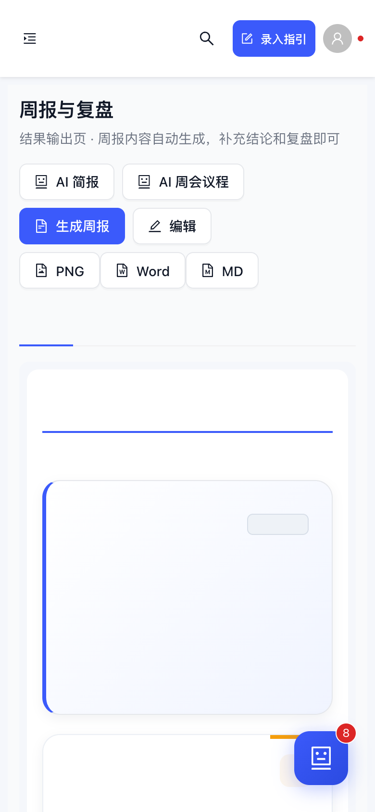

<h1 align="center">
  
  LeoBMS · 增长部门管理系统
</h1>

<p align="center">
  <b>把业务数据放进一个系统，把每周复盘变成可交付。</b><br>
  Run growth data in one place. A weekly review lands ready to ship.<br>
  <a href="#系统截图">截图</a> ·
  <a href="#核心功能">五大模块</a> ·
  <a href="#快速开始">快速开始</a> ·
  <a href="#技术栈">技术栈</a> ·
  <a href="#api-文档">API</a> ·
  <a href="#部署到-ubuntu-服务器">部署</a> ·
  <a href="#版本更新日志">版本</a> ·
  <a href="docs/README.en.md">English</a>
</p>

<p align="center">
  
  
  
  
  
  
  
  
  
  
</p>

<p align="center">
  
</p>

<p align="center">
  <sub>专为增长组设计的业务数据管理 Web 系统：5 大业务模块 · 可视化驾驶舱 · 智能周报生成 · ASO / CPS 速览 · 数据导入导出 · 移动端就绪。</sub>
</p>

<p align="center">
  简体中文 | <a href="docs/README.en.md">English</a>
</p>

---

## 是什么

LeoBMS（**Leo Business Management System**）是一套**部门级业务数据中枢**，把"KPI 核心指标、重点工作、业务线业绩、月度工作、季度成果"5 大模块装进同一套权限/驾驶舱/周报闭环里，让管理者一周一份**带结论、带关键变化、带下周焦点的可交付周报**。

- **驱动行动而非展示数据**：管理驾驶舱不是仪表盘秀场，"今日变化 + 本周关注"双栏推动当周的下一步动作
- **周 + 日双节奏**：周一规划、周中跟进、周五自动生成周报草稿（node-cron），项目今日更新写回项目表 + 审计日志
- **结论由规则驱动**：周报本周结论 / 关键变化由规则引擎自动写入，不依赖 LLM 幻觉，LLM 只负责润色
- **ASO / CPS 业务速览**：周报集成 ASO 关键词到榜、CPS 实收 / 签约 / 日环比，异常自动写入告警
- **管理优先排序**：项目列表"风险 > 临期 > 低进度 > 其他"，让人 5 秒锁定要救的项目
- **跨端可用**：移动端 PWA 就绪，周报支持 PNG / Word / Markdown / 富文本（飞书 / 腾讯文档 / Notion 友好）导出

<a id="系统截图"></a>

## 系统截图

<table>
  <tr>
    <td align="center"><b>管理驾驶舱</b></td>
    <td align="center"><b>周管理</b></td>
  </tr>
  <tr>
    <td></td>
    <td></td>
  </tr>
  <tr>
    <td align="center"><b>项目推进</b></td>
    <td align="center"><b>周报移动端</b></td>
  </tr>
  <tr>
    <td></td>
    <td align="center"></td>
  </tr>
</table>

## 技术栈

- **前端**：React 18 + Vite + Ant Design 5 + ECharts 5 + html-to-image
- **后端**：Node.js + Express 4 + Sequelize ORM + DeepSeek LLM + SQLITE_READONLY 自愈
- **数据库**：PostgreSQL 14+ / SQLite（本地开发 + 生产）
- **认证**：短期 Access Token + HttpOnly Refresh Cookie + bcrypt + token_version 校验
- **AI**：DeepSeek Chat + 规则引擎 + 结构化 JSON 输出 + 个人提醒/项目诊断/备会分析 + SSE 流式输出
- **部署**：Docker + Docker Compose / 本地 Mac + Cloudflare Tunnel

## 快速开始

### 方式一：Docker 一键部署（推荐）

```bash
# 1. 克隆项目
cd growth-system

# 2. 启动所有服务（PostgreSQL + 后端 + 前端 Nginx）
docker-compose up -d

# 3. 查看服务状态
docker-compose ps

# 4. 访问系统
# 前端：http://localhost
# 后端 API：http://localhost:3001
# 健康检查：http://localhost:3001/health
```

### 方式二：本地开发

#### 一键启动（推荐 · 前后端同端口 3001）

```bash
# 1. 安装依赖
cd backend && npm install && cd ../frontend && npm install

# 2. 构建前端
cd frontend && npm run build

# 3. 一键启动（后端托管前端静态文件 + API，同端口 3001）
./start.sh

# 4. 访问 http://localhost:3001
# 外网：配合 cloudflared tunnel --url http://localhost:3001
```

> **架构说明**：后端 Express 同时托管前端 build 产物和 API，SPA 路由回退到 index.html，无需额外代理或 serve 进程。

#### 前后端分离开发模式

##### 后端启动

```bash
cd backend

# 安装依赖
npm install

# 配置环境变量（可选，默认连接本地 PostgreSQL）
export DB_HOST=localhost
export DB_PORT=5432
export DB_NAME=growth_system
export DB_USER=growth
export DB_PASSWORD=growth123
export JWT_SECRET=$(openssl rand -hex 32)
export JWT_EXPIRES_IN=7d

# 使用 SQLite 模式（无需 PostgreSQL）
export DB_DIALECT=sqlite
npm run dev
```

#### 前端启动

```bash
cd frontend

# 安装依赖
npm install

# 启动开发服务器
npm start

# 访问 http://localhost:3000
```

#### 数据库初始化

系统首次启动时会自动同步表结构。如需手动初始化数据：

```bash
# 连接 PostgreSQL 后执行 init.sql
psql -U growth -d growth_system -f backend/init.sql
```

```
生产环境：禁止使用默认密码。首次部署后必须修改所有账号密码。
开发环境：seed 脚本会创建 `admin`、`expand`、`ops` 三个账号；默认密码会随机化并要求首次登录改密。
如需本地固定 seed 密码，请在 `.env` 显式设置 `DEFAULT_SEED_PASSWORD`；只有设置 `ALLOW_INSECURE_DEFAULT_SEED=true` 时才会启用旧的 `123456` 开发捷径。
```

## 项目结构

```
growth-system/
├── start.sh                    # 一键启动脚本（DB_DIALECT=sqlite + 前后端同端口）[v3.2]
├── start-prod.sh               # 生产启动脚本（pm2 + 环境变量）[v6.1]
├── docker-compose.yml          # Docker 编排配置
├── backend/                    # 后端服务
│   ├── Dockerfile
│   ├── package.json
│   ├── growth_system.sqlite   # SQLite 数据库（本地开发）[v3.2]
│   ├── init.sql               # 数据库初始化脚本
│   ├── data/                  # 静态数据 [v6.2]
│   │   └── changelog.json     # 版本更新日志 [v6.2]
│   ├── backup.sh              # 自动备份脚本 [v6.1]
│   ├── config/
│   │   └── database.js        # 数据库配置（支持 PostgreSQL / SQLite 切换）
│   └── src/
│       ├── app.js             # 应用入口（含前端静态托管 + SPA回退）[v3.2]
│       ├── routes/            # 路由配置
│       │   └── fileRoutes.js  # 文件鉴权下载路由 [v6.1]
│       ├── models/            # Sequelize 数据模型（5表 paranoid 软删除）[v6.1]
│       ├── controllers/       # 业务控制器
│       ├── services/          # 业务服务（周报生成、定时任务）
│       ├── middleware/        # 中间件（认证、权限、限流、DB 健康检测）
│       ├── utils/             # 工具函数
│       └── ai/                # AI 助手模块 [v6.0]
│           ├── controllers/   # AI 控制器（含 SSE streamChat）[v6.1]
│           ├── services/      # LLM Provider / 编排器 / 上下文服务
│           ├── routes/        # AI 路由
│           └── utils/         # promptSecurity / aiOutputParser / aiFormatters [v6.1]
├── frontend/                   # 前端应用
│   ├── Dockerfile
│   ├── package.json
│   ├── nginx.conf             # Nginx 配置
│   └── src/
│       ├── App.js             # 路由配置（React.lazy 懒加载）[v6.1]
│       ├── index.jsx          # Vite 入口文件
│       ├── index.css          # Design Token CSS 变量体系 [v6.1]
│       ├── hooks/             # 自定义 Hooks（useAuth / useSubmitGuard / useAIStream）[v6.1]
│       ├── utils/             # 工具函数
│       │   └── constants.js   # 统一状态色/进度色/样式常量 [v3.0]
│       ├── components/        # 公共组件
│       │   ├── ErrorBoundary.js  # 错误边界（全局+每页）[v6.1]
│       │   └── AsyncState.js     # 统一异步状态组件 [v6.1]
│       └── pages/             # 页面组件
│           ├── DashboardPage.js      # 管理首页（今日提醒+本周关注+重点推进+长期未更新）[v3.2重构]
│           ├── KpiPage.js            # 核心指标（含业务线业绩表）[v3.0增强]
│           ├── ProjectPage.js        # 重点工作（今日更新+行内编辑+快速更新+优先排序）[v3.2增强]
│           ├── WeekPage.js           # 周管理页（本周概览/今日更新/下周重点）[v3.0新增]
│           ├── SettlementPage.js     # 沉淀页（月度+季度统一视图）[v3.0新增]
│           ├── PerformancePage.js    # 业务线业绩
│           ├── MonthlyTaskPage.js    # 月度工作
│           ├── AchievementPage.js    # 季度成果
│           ├── WeeklyReportPage.js   # 周报管理（含结论+关键变化）[v3.0增强]
│           ├── ImportPage.js         # 数据导入
│           └── UserPage.js           # 用户管理
└── README.md
```

## 核心功能

### 1. 五大业务模块

| 模块 | 对应表 | 核心功能 |
|------|--------|----------|
| A - 核心指标 | kpis | 按部门×季度管理 GMV/净利润，后端硬计算完成率 |
| B - 重点工作 | projects | 项目追踪、进度可视化、风险标红、严重预警、行内编辑、管理优先排序 [v3.0] |
| C - 业务线业绩 | performances | Q1-Q4 目标/完成追踪、后端硬计算预警状态 |
| D - 月度工作 | monthly_tasks | 按月筛选、完成度追踪、下月跟进 |
| E - 季度成果 | achievements | 成果沉淀、跨季度复用、优先级筛选 |

### 2. 管理驾驶舱（Dashboard）[v3.2 重构]

- **今日变化 + 本周关注**：双栏管理信息流，驱动行动而非仅展示数据
- **KPI 卡片**：当前季度两部门 GMV 完成率、净利润完成率、风险项目数
- **重点推进事项**：自动筛选风险/临期/低进度项目
- **长期未更新项目**：7/10/14天分级提醒
- **今日更新 Drawer**：从驾驶舱弹出，查看变更流 + 待更新项目 + 快捷录入入口（更新操作引导至项目推进页）
- **图表区**：工作状态分布饼图、快捷操作面板

### 3. 周+日双节奏管理 [v3.2 更新]

- **周管理页**（/week）：三 Tab 架构
  - 📋 本周概览：本周关注点、风险项目、临期项目、全部项目进度
  - 📝 今日更新：当日变化流、3天未更新预警、今日到期提醒
  - ⚡ 下周重点：下周到期项目、需关注项目
- **今日更新机制** [v3.2 重构]：
  - 每个项目卡片新增"今日更新"操作按钮，打开增强版更新 Drawer
  - 增强版更新支持：📊进度 + 🏷️状态 + 📝本周进展 + ⚠️风险与问题（一键保存写回项目表）
  - Dashboard 的今日更新 Drawer 聚焦"变更展示"，更新操作引导至项目推进页
  - 数据闭环：今日更新 → 写入项目表 → AuditLog 自动记录 → Dashboard 变更流展示

### 4. 智能周报生成 [v3.0 增强]

**触发方式**：
- 手动：仪表盘点击"生成周报"按钮
- 自动：每周五 18:00 自动生成周报草稿（node-cron）

**周报内容**：
1. **本周结论** [v3.0]：规则驱动自动生成，涵盖 KPI 完成率、风险项、预警状态
2. **关键变化** [v3.0]：风险状态变化、高进度项目、KPI 偏差/达成
3. 本周数据摘要（KPI 完成率对比）
4. 重点工作进展（本周更新项目清单）
5. 风险与预警（风险项目 + 严重预警指标）
6. 下周焦点（即将到期项目 + 下月跟进事项）
7. 新增成果（本周新增/更新成果记录）

### 5. 统一状态与交互体系 [v3.0]

- **状态色统一**：`utils/constants.js` 全局共享（进行中=蓝/完成=绿/风险=红/未启动=灰）
- **进度色规则**：≥80% 绿 / ≥60% 黄 / <60% 红
- **逾期标签**：逾期(红) / 临期(橙) / 剩余天数(灰)
- **管理优先排序**：风险 > 临期 > 低进度 > 其他
- **沉淀页**（/settlement）：月度工作 + 季度成果统一视图

- **Excel 导入**：支持从现有"部门追踪总表.xlsx"一键导入，自动识别 5 个 Sheet
- **Excel 导出**：按模块导出数据，包含后端计算的完成率和预警状态
- **PDF 导出**：按季度导出周报 PDF

## API 文档

### 认证
- `POST /api/auth/login` - 登录
- `GET /api/auth/me` - 获取当前用户
- `POST /api/auth/change-password` - 修改密码

### 用户管理（管理员）
- `GET /api/users` - 用户列表
- `POST /api/users` - 创建用户
- `PUT /api/users/:id` - 更新用户
- `DELETE /api/users/:id` - 删除用户

### 核心指标
- `GET /api/kpis?quarter=Q1&year=2026` - KPI 列表
- `GET /api/kpis/dashboard` - 仪表盘 KPI 数据
- `POST /api/kpis` - 创建 KPI
- `PUT /api/kpis/:id` - 更新 KPI
- `DELETE /api/kpis/:id` - 删除 KPI

### 重点工作
- `GET /api/projects?quarter=Q1&status=进行中&sort=priority` - 项目列表（sort=priority 管理优先排序 [v3.0]）
- `GET /api/projects/dashboard` - 项目统计
- `GET /api/projects/stale?days=7` - 长期未更新项目 [v3.2]
- `POST /api/projects` - 创建项目
- `PUT /api/projects/:id` - 更新项目
- `PUT /api/projects/:id/quick-update` - 今日更新（进展+进度+状态+风险）[v3.2]
- `DELETE /api/projects/:id` - 删除项目

### 业务线业绩
- `GET /api/performances` - 业绩列表
- `GET /api/performances/dashboard` - 业绩统计
- `POST /api/performances` - 创建业绩
- `PUT /api/performances/:id` - 更新业绩
- `DELETE /api/performances/:id` - 删除业绩

### 月度工作
- `GET /api/monthly-tasks?month=2026-04` - 月度工作列表
- `POST /api/monthly-tasks` - 创建月度工作
- `PUT /api/monthly-tasks/:id` - 更新月度工作
- `DELETE /api/monthly-tasks/:id` - 删除月度工作

### 季度成果
- `GET /api/achievements?quarter=Q1&priority=高` - 成果列表
- `POST /api/achievements` - 创建成果
- `PUT /api/achievements/:id` - 更新成果
- `DELETE /api/achievements/:id` - 删除成果

### 仪表盘
- `GET /api/dashboard?mode=quarter|year` - 综合仪表盘数据
- `GET /api/dashboard/today-changes` - 今日数据变更列表 [v3.2]
- `GET /api/dashboard/week-focus` - 本周关注点（规则驱动）[v3.2]
- `GET /api/dashboard/week-summary` - 本周摘要统计 [v3.2]

### AI 助手
- `POST /api/ai/panel` — 获取面板数据
- `POST /api/ai/analyze` — AI 分析（含项目结构化诊断）
- `POST /api/ai/chat` — 自由问答
- `POST /api/ai/chat-stream` — 流式自由问答（SSE）
- `POST /api/ai/briefing` — 生成简报
- `POST /api/ai/weekly-operating-brief` — AI 经营分析/备会材料（不覆盖正式周报）[v1.18.0]
- `GET /api/ai/personal-digest` — 我的 AI 提醒（内部展示，不发邮件）[v1.18.0]
- `GET /api/ai/badge-summary` — 角标摘要

### 文件下载（鉴权）
- `GET /api/files/exports/:filename` — 下载导出文件（需 export.data 权限）
- `GET /api/files/weekly-reports/:filename` — 下载周报文件（需 weekly_report.read 权限）

### 周报
- `POST /api/weekly-reports/generate` - 生成周报
- `GET /api/weekly-reports` - 周报列表
- `GET /api/weekly-reports/latest` - 最新周报
- `GET /api/weekly-reports/:id` - 周报详情
- `GET /api/weekly-reports/:id/png` - 周报 PNG 截图 [v6.2]
- `PUT /api/weekly-reports/:id/content` - 更新周报内容（合并 content_json）[v6.2]
- `PUT /api/weekly-reports/:id/html` - 保存 HTML 内容
- `PUT /api/weekly-reports/:id/files` - 保存文件链接

### 健康检查
- `GET /health` - 服务健康状态（含 `db_writable` 数据库写入状态）[v6.2]

### 更新日志
- `GET /api/changelog` - 获取系统更新日志（无需认证）[v6.2]

### 导入导出
- `POST /api/import/excel` - 导入 Excel（multipart/form-data）
- `GET /api/export/:module` - 导出模块数据（module: kpis/projects/performances/monthly-tasks/achievements）

### 统一响应格式

```json
{
  "code": 0,      // 0=成功，非0=失败
  "data": {},     // 响应数据
  "message": ""   // 提示信息
}
```

## 数据库表结构

| 表名 | 说明 |
|------|------|
| departments | 部门表（拓展组、运营组、管理者） |
| users | 用户表（管理员/部门账号） |
| kpis | A表：核心指标 |
| projects | B表：重点工作追踪（支持今日更新 quick-update） |
| performances | C表：业务线业绩追踪 |
| monthly_tasks | D表：月度重点工作 |
| achievements | E表：季度成果沉淀 |
| weekly_reports | 周报表 |
| audit_logs | 审计日志（今日变更流数据源） |
| quarter_archives | 季度归档 |

| ai_call_logs | AI 调用日志 |
| ai_result_cache | AI 结果缓存 |
| ai_user_digests | AI 个人提醒摘要 [v1.18.0] |
| ai_user_digest_items | AI 个人提醒明细 [v1.18.0] |
| ai_feedback | AI 反馈记录 [v1.18.0] |

## 部署到 Ubuntu 服务器

```bash
# 1. 将项目上传到服务器
scp -r growth-system user@VM-1-48-ubuntu:/opt/

# 2. 服务器上执行
cd /opt/growth-system
docker-compose up -d

# 3. 查看日志
docker-compose logs -f backend
docker-compose logs -f frontend

# 4. 更新部署
docker-compose down
git pull  # 或上传新版本
docker-compose up -d --build
```

## 注意事项

1. **生产环境部署前**：
   - 修改 `JWT_SECRET` 为强密码
   - 修改数据库密码
   - 关闭 `sequelize.sync({ alter: true })`，改用迁移脚本
   - 配置 HTTPS

2. **数据备份**：
   ```bash
   # 备份数据库
   docker exec growth-db pg_dump -U growth growth_system > backup.sql
   
   # 恢复数据库
   docker exec -i growth-db psql -U growth growth_system < backup.sql
   ```

3. **周报 PNG 生成**：
   - 使用 html-to-image 在前端生成，宽度固定 1200px
   - 如需服务端生成，可配置 puppeteer（已包含在依赖中）

## 版本更新日志

### v1.18.0 — 2026-05-29 · AI 旁路增强 · 个人提醒 · 项目诊断 · 备会分析

> 核心改动：在不覆盖正式周报、不自动修改业务数据的前提下，把 AI 从通用抽屉升级为业务侧边工作流。

**AI 旁路增强**
- 新增统一 LLM 调用包装：文本/JSON 分流、调用日志、短 TTL 缓存、JSON 解析失败降级。
- 项目 AI 诊断输出结构化字段：根因、建议动作、风险候选、周报素材、会议追问。
- 新增“我的 AI 提醒”：基于项目风险、进度滞后、KPI 偏差、待办临期、闭环缺口生成内部提醒，不发送邮件。
- 新增 AI 经营分析/备会材料：独立于正式周报，提供关键变化、高风险项目、KPI 偏差、会上拍板问题和可复制素材。
- 前端新增轻入口：Dashboard AI 提醒、Project AI 诊断、WeeklyReport AI 备会分析。

**安全与稳定**
- 新增 feature flags：`AI_SIDE_CAR_ENABLED`、`AI_PERSONAL_DIGEST_ENABLED`、`AI_WEEKLY_OPERATING_BRIEF_ENABLED`、`AI_EMAIL_ENABLED`。
- AI 建议默认只读展示；action/risk 写入继续要求用户确认。
- 修复 CPS AI 控制器调用不存在的 provider 方法问题。

### v1.17.5 — 2026-05-25 · CPS看板日环比升级 · 退款率展示下线

> 核心改动：CPS核心指标不再展示退款率，改为“较前一日”的实收、签约、退款笔数变化。

**CPS看板优化**
- 核心指标第三张卡从“退款率”替换为“较前一日”，主展示当日实收和环比百分比
- 新增日环比后端字段 `day_over_day`，按当前筛选范围内最新有数据日期对比前一日
- 卡片补充实收变化、签约变化、退款笔数变化；前日为 0 时显示“前日为0”，避免伪造百分比
- 固定窗口对照的当季指标不再展示退款率，改为退款笔数

### v1.17.4 — 2026-05-25 · 周报默认周期修复 · 周一复盘上周进展

> 核心改动：修复周一生成周报时只取“本周一至今天”，导致上周重点工作进展缺失的问题。

**周报生成修复**
- 未指定日期时默认生成上一完整自然周，匹配周一部门会复盘上周工作的实际使用方式
- 重点工作进展优先按项目更新日志 `update_date` 归属到周报周期，避免周一编辑下周重点覆盖 `updated_at` 后丢失上周进展
- 保留显式 `week_start` / `week_end` 参数能力，需要指定其他周期时仍可传入日期范围
- 新增默认周报周期单元测试，覆盖上一完整 ISO 周和手动日期范围

### v1.17.3 — 2026-05-17 · 周报会议文档复制优化 · 在线文档粘贴友好版

> 核心改动：针对在线文档粘贴后的宽表错位、横向滚动、长文本窄列问题，重做「复制会议文档」模板。

**会议文档复制优化**
- 复制模板从“网页卡片/宽表格”改为在线文档更稳定的标题、段落、短表和项目块
- KPI 数据摘要保留 4 列窄表；重点工作、风险预警、下周重点、新增成果改为列表式项目块
- 纯文本兜底改为会议文档结构化文本，不再使用 Markdown 宽表
- PNG、Word、Markdown 导出保持原逻辑不变，仅优化 `复制会议文档` 入口

### v1.17.2 — 2026-05-17 · 周报复制到会议文档 · 富文本粘贴输出

> 核心改动：在现有“生成周报 → 编辑保存 → 导出”的流程上新增「复制会议文档」，复制内容为可选中、可点击、可编辑的富文本，而不是图片。

**会议文档复制**
- 新增 `复制会议文档` 按钮，写入剪贴板 `text/html` + `text/plain` 双格式
- 富文本模板使用在线文档更稳定的 table + inline style，不依赖复杂 CSS、flex 或 grid
- 支持飞书文档、腾讯文档、Notion、Google Docs 等常见在线文档的粘贴场景
- 编辑中会提示先保存，确保复制走的是确认后的周报内容
- 历史周报弹窗也支持复制会议文档，并修正历史导出读取 `content` 的路径

### v1.17.1 — 2026-05-17 · 安全边界修复 · 周报权限加固 · Vite构建升级

> 核心改动：修复周报跨部门读写/导出边界；加固服务端截图与Excel导出；Refresh Token迁移到HttpOnly Cookie；前端构建从 react-scripts 升级到 Vite。

**安全修复**
- 周报列表、详情、PNG导出按部门权限过滤，部门用户无法导出或读取其他部门/全局周报内容
- 周报HTML保存与文件链接保存收敛为管理员操作，文件链接仅允许 `/api/files/weekly-reports/` 下的安全文件名
- Puppeteer PNG截图模板统一HTML转义，禁用页面脚本和外部资源请求，降低服务端渲染XSS/SSRF风险
- Refresh Token 从前端持久化存储迁移到 HttpOnly SameSite Cookie；Access Token 改为内存态，保留旧 localStorage refreshToken 平滑迁移
- Excel导出统一防公式注入，`= + - @` 开头的字符串写出时自动加 `'` 前缀

**正确性修复**
- 修复 Project / MonthlyTask / Achievement 外键引用模型名与实际表名不一致的问题
- 项目归档校验改用 `project.year`，避免跨年归档被绕过或误拦截
- `quick-update` 更新后 reload 实例，返回值、审计日志、同步逻辑使用最新数据
- 修复成员项目数据范围引用不存在字段、项目搜索条件被角色过滤覆盖的问题

**构建与测试**
- 前端从 `react-scripts` 迁移到 Vite，仍输出到 `frontend/build`，后端静态托管逻辑不变
- 新增后端 `npm test`，覆盖 Excel 公式注入防护和周报跨部门数据检测
- 前后端 `npm audit` 当前均为 0 漏洞

### v1.17.0 — 2026-05-11 · 周报仪表盘升级 · ASO/CPS业务速览 · 新UI组件库 · 看板视觉重设计

> 核心改动：周报全面整合 ASO/CPS 业务数据；4个新通用UI组件；驾驶舱和看板视觉升级；周报生成逻辑增强。

**周报业务速览（全新 Section）**
- 周报新增「二、重点业务速览」section，位于 KPI 摘要和项目进展之间
- ASO 卡片：优化词/T1/T3到榜/消耗四个 MiniMetric + T3 趋势 Sparkline + 新到 T1/T3 关键词 Tag
- CPS 卡片：实收/签约/退款率/预警四个 MiniMetric + 实收趋势 Sparkline + 退款率超5%红色告警
- 权限控制：`includeAso`/`includeCps` 根据用户权限决定是否聚合，无权限显示"无查看权限"

**周报结论增强**
- `generateWeekConclusion` 接入 ASO/CPS：退款率超阈值自动写入结论，T3关键词变化写入结论
- `extractKeyChanges` 接入 ASO/CPS：CPS 退款率风险、实收变化、ASO T3 变化自动列入关键变化

**4个新通用 UI 组件**
- `DeltaPill`：涨跌药丸（绿涨红跌，sm/md尺寸，inverse反转）
- `MiniMetric`：迷你指标卡片（label+value+delta+alert标签）
- `SectionHeader`：分区标题（icon+title+subtitle+extra）
- `Sparkline`：迷你趋势折线图（ECharts轻量封装，渐变面积填充）

**周报视觉升级**
- 结论区：渐变背景+左侧4px色条+阴影+KEY TAKEAWAYS标签
- 关键变化：标签化（Tag+borderLeft+彩色背景），替换旧emoji图标
- KPI 执行指标：三列大卡片（GMV完成率/利润完成率/时间进度）
- EditableCell：重构为 `React.memo`，显式 props（editing/onChange/cellStyle）

**驾驶舱视觉升级**
- KPI 主卡片：底部大数字水印+渐变进度条+图标圆角背景
- 状态分布饼图：中心显示项目总数
- 卡片间距和字号微调

**ASO/CPS 看板重构**
- ASO：`AsoKpiCard` 组件化 + `KeywordChangeBlock` 关键词变化 + `useCallback` 优化渲染
- CPS：`getTopChannels` Top5 渠道排行 + `getChannelAmounts` 聚合 + 同比对比窗口

**周报生成修复**
- 默认日期改为上一完整自然周（`isoWeek`），避免周一生成时纳入未来日期
- 后端传入 `includeAso`/`includeCps` 权限参数 + `cpsChannelId` 渠道隔离

详见 [changelog.json](backend/data/changelog.json)

### v1.16.1 — 2026-05-11 · 周报编辑修复 + 下周重点隐藏功能 + KPI模糊匹配

> 核心改动：修复周报编辑模式无法输入文字的致命Bug；下周重点工作增加隐藏按钮；KPI指标名模糊匹配。

**周报编辑修复（P0 Bug）**
- 根因：`addRowSpan()` 浅拷贝 `{ ...item, deptRowSpan: 0 }` 创建了脱落数据源，`EditableCell` 的 `value` 从拷贝读取（过时值），`onChange` 写入 `editData`（原始源），React 重渲染时用旧值覆盖用户输入
- 修复：`value={items[origIdx][columns.textField]}` 直接从 `items`（即 `editData`）读取，`key` 也改为 `origIdx`，保证 value/onChange/path 三者一致
- 新增 `_origIdx` 追踪：过滤/合并后仍能映射回原数组索引

**下周重点工作隐藏功能**
- 编辑模式下新增 `EyeInvisibleOutlined` 隐藏按钮，与"重点工作进展"交互一致
- 隐藏后项目标题显示隐藏计数，下方恢复区 `EyeOutlined` Tag 可点击恢复
- 导出路径全覆盖：`generateMarkdown` / `generateDocHtml` / `reportScreenshotService` / `weeklyReportService` 四路同步过滤 `_hidden` 项

**KPI 指标模糊匹配**
- `dashboardController` / `weeklyReportService` 中指标名匹配从 `=== 'GMV'` 改为 `.includes('GMV')`，`=== '净利润'` 改为 `.includes('利润')`
- 兼容"部门GMV"、"净利润（含税）"等指标名变体

详见 [changelog.json](backend/data/changelog.json)

### v1.16.0 — 2026-05-09 · 安全深度加固 · ExcelJS替换xlsx · 密码策略 · Refresh Token哈希 · 数据范围重构

> 核心改动：全面安全审计与修补，覆盖Excel解析防护、密码策略升级、Token哈希存储、数据范围过滤重构、首次改密强制、Nginx安全头、Docker非root运行。

**Excel解析安全（xlsx → ExcelJS）**
- 全局替换 `xlsx` 为 `exceljs`（通过 `safeExcel.js` 封装），防止原型污染和公式注入
- `normalizeCellValue` 全面清理富文本/超链接/公式结果，`dangerousKeys` 拦截 `__proto__/prototype/constructor`
- 导入控制器、ASO导入、CPS导入、导出服务、模板下载全部迁移到新接口

**密码策略升级**
- 新增 `passwordPolicy.js`：最低8位 + 字母数字混合 + 弱密码黑名单（12345678/admin123/growth123等）
- 前端同步校验（创建用户/重置密码/修改密码全部 ≥8位 + 字母数字混合）
- 新建用户默认 `must_change_password: true`

**Refresh Token 安全**
- Token 存储从明文改为 SHA-256 哈希，不再可逆
- 向后兼容：查询时先尝试哈希匹配，再降级明文匹配（旧数据平滑迁移）
- 密码修改/重置/用户禁用/删除时自动 `revokeAllUserTokens`

**首次改密强制**
- `authenticate` 中间件拦截 `must_change_password=true` 用户，仅放行改密/登出接口
- 返回 `error_type: PASSWORD_CHANGE_REQUIRED`，前端 `password-change-required` 事件监听
- 改密弹窗不可关闭、不可跳过，完成后 `must_change_password` 置 false

**数据范围过滤重构**
- 行动项/风险台账自建 `buildActionItemScopeWhere`/`buildRiskScopeWhere`，替代 `req.dataScope.where` 直传
- `self` 模式按 `owner_id/created_by` 过滤；`department` 模式按部门成员ID+项目ID联合过滤
- AI 落地端新增 `validateAssignmentScope`：跨部门/跨项目越权指派返回 403
- AI 上下文按资源类型分建 scopeWhere（project/kpi/performance）

**其他安全加固**
- `ensureExcelFile` 中间件：强制校验 `.xlsx/.csv` 扩展名，multer 错误友好提示
- Nginx 安全头：X-Content-Type-Options/X-Frame-Options/Referrer-Policy/Permissions-Policy
- Dockerfile `USER node` 非 root 运行
- README JWT_SECRET 示例改用 `openssl rand`
- `.gitignore` 新增 `*.sqlite.*` 和 `backend/backups/`
- ASO 导入日期新增 `formatDate` 统一处理序列号/中文日期/Date 对象
- 导入控制器修复 `results` 变量名错误 + `finally` 块清理临时文件
- 全局移除 `.xls` 支持，统一 `.xlsx/.csv`
- 前端 401 自动 refresh token 续期 + 并发请求去重

详见 [changelog.json](backend/data/changelog.json)

### v1.15.4 — 2026-05-09 · ASO系统调整 2.0 + UI布局优化 + DB补丁

> 核心改动：ASO 模块批量导入与指标重构；对齐日报标准模板；修复产品刷新与数据库字段缺失。

**ASO 系统调整 2.0**
- **批量导入**：关键词字典支持 Excel 一键导入初始排名和指数。
- **板块重构**：将“元数据管理”重构为“基准指标管理”，完整覆盖 8 个关键指标（覆盖数/T3/T10/排名）。
- **日报对齐**：导入逻辑适配 15 字段《日报模版.xlsx》，强制“先选产品”流程。
- **刷新修复**：解决字典管理中新增产品列表空白的问题。

**系统优化与补丁**
- **UI 布局**：驾驶舱“各组指标”卡片宽度调整（xl=8），提升 3 指标场景下的视觉对齐度。
- **DB 补丁**：手动修复 `Kpis` 表 `owner_user_id` 缺失问题，恢复 AI 驾驶舱分析能力。

详见 [changelog.json](backend/data/changelog.json)

### v1.15.3 — 2026-05-08 · ASO种子+导入增强+CPS权限修正+默认产品

> 18文件覆盖：ASO产品标准化、导入模板下载、看板日期对比、CPS渠道权限强制、导入默认产品支持。

**ASO 增强**
- 启动时自动种子词典/echo/翻译官默认产品，中文名标准化映射（网易有道词典→词典、有道翻译官→翻译官）
- 新增 `/aso/template/daily-import` 模板下载端点，一键获取标准 XLSX 模板
- 导入支持前端选择默认产品（Excel 无产品列时使用该产品）
- 看板改为日期选择器，新增 DeltaTag 涨跌指标（排名变化、量级对比）

**CPS 修正**
- `cps_channel_user` 数据范围强制切换为 `cps_channel`，解决权限叠加后仍用自部门范围的问题
- 用户创建/更新时校验 CPS 渠道账号必须绑定渠道
- 导入支持 `default_product_id` 参数（Excel 无产品列时指定默认产品）
- 渠道导入结果区分 0 成功提示 + CpsMetricsTab 渠道用户自动锁过滤

**权限**
- `isCpsChannelUser` 函数兼容 `role=cps_channel_user` 和 `cps_role=channel_user` 双模式

详见 [changelog.json](backend/data/changelog.json)

### v1.15.2 — 2026-05-08 · CPS渠道用户Excel批量导入

> `cps_channel_user` 角色新增 Excel 批量导入能力，后端自动强制归属本渠道。

- 后端新增 `/cps/channel-import` 路由（权限 `cps.channel_upload`），中间件自动注入 `forced_channel_id` 取自 `dataScope`
- 前端 `CpsChannelEntryTab` 新增「Excel 批量导入」按钮，Upload 组件直接提交
- `cpsService.channelImportMetrics` 调用专属端点，无需传渠道参数

详见 [changelog.json](backend/data/changelog.json)

### v1.15.1 — 2026-05-08 · 权限完善+导出增强+dataScope修复+ASO修正

> 21文件覆盖：渠道用户权限升级、导出筛选增强、数据范围补漏、ASO看板/导入修正。

**权限与用户管理**
- `cps_channel_user` 角色新增 `cps.read` 权限，渠道用户可查看自己渠道数据
- 创建用户 API 支持 `aso_role` / `email` / `mobile` / `status` / `must_change_password` 全字段
- UserPage 新增 ASO 角色颜色标签 + CPS 渠道下拉选择

**CPS 增强**
- 导出 API 支持渠道/产品/来源筛选，并应用 dataScope 确保渠道用户仅导出自己数据
- 看板预警数跟随时间窗口过滤，不再统计历史遗留 open 事件
- CpsMetricsTab 区分 403 权限拒绝与网络异常

**dataScope 修复**
- 行动项/风险台账聚合统计补充 dataScope 部门过滤
- auth.js self scope 移除 action_item（改用控制器自身逻辑）

**ASO 修正**
- 看板 T1-2 排名改用 `current_rank` [1,2] 范围判断（之前用不存在的 `is_t1` 字段）
- 导入改为每行独立解析产品，支持同一 Excel 多产品混合导入

详见 [changelog.json](backend/data/changelog.json)

### v1.15.0 — 2026-05-08 · ASO苹果商店优化模块 + CPS预警增强 + 生产Sync修复

> 核心改动：全新ASO业务模块上线；CPS新增手动触发预警；生产环境启用模型同步自动建表。

**ASO 苹果商店优化模块（全新）**
- 10 张独立表：`aso_products` / `aso_keywords` / `aso_daily_keyword_metrics` / `aso_campaigns` / `aso_campaign_keywords` / `aso_campaign_daily_plans` / `aso_product_baseline_metrics` / `aso_metadata_versions` / `aso_snapshots` / `aso_import_logs`
- 23 个 API 端点：产品CRUD / 关键词CRUD / 看板 / 日指标 / 投放计划 / 元数据版本 / 基线指标 / 导入导出
- 前端 6 个 Tab：看板 / 关键词管理 / 投放管理 / 日导入 / 元数据 / 管理配置
- 三独立 ASO 角色：`aso_admin` / `aso_ops` / `aso_viewer`，权限叠加体系与前缀匹配策略一致
- 用户表新增 `aso_role` 字段；菜单新增 ASO优化入口（`AppleOutlined` 图标）

**CPS 增强**
- 预警页新增「立即检查」按钮，管理员可随时手动触发生成最新预警
- 渠道用户数据范围改为显式 `where.channel_id` 处理，避免 `mergeDataScope` 中 `dept_id` 等无关字段污染 CPS 表查询
- CpsAlertsTab 错误处理增强：区分 API 错误与网络异常

**基础设施修复**
- `app.js` 移除 `NODE_ENV !== 'production'` sync 跳过条件，生产环境也跑 `sequelize.sync({ force: false })` 以确保新模块表自动创建
- auth.js 新增 ASO 角色权限定义与数据范围映射

详见 [changelog.json](backend/data/changelog.json)

### v1.14.0 — 2026-05-07 · 安全兜底+性能优化+缓存修复+DataFrame增强

> 12文件覆盖：数据库密码安全、并发乐观锁、仪表盘N+1优化、Cloudflare缓存修复、CPS事务化、AI落地字段校验、Excel逐sheet独立事务。

**安全加固**
- 生产环境数据库移除默认明文密码（`database.js`），JWT密钥统一来源移除硬编码fallback（`refreshTokenService.js`）。
- 项目更新增加乐观锁：`updated_at` 校验防止并发编辑覆盖，冲突返回 409 提示刷新重试（`projectController.js`）。

**性能优化**
- 仪表盘今日变更批量查询替代 N+1：同表 ID 聚合后单次 `WHERE id IN (...)` 返回（`dashboardController.js`）。
- changelog API 运行时内存缓存，避免每次请求读磁盘文件（`routes/index.js`）。

**CDN缓存修复**
- `/static` 路径强制 `Cache-Control: no-cache, no-store, must-revalidate`，根治 Cloudflare 边缘缓存导致 `main.js` 与 chunk hash 版本不一致的加载失败问题（`app.js`）。

**CPS增强**
- 按日快捷选择从「近7天」修正为「仅当天」；趋势图按日不限数据集，避免截断（`CpsDashboardTab.js`、`cpsDashboardService.js`）。
- `upsertMetric` 事务化：快照创建+数据更新原子提交，异常自动回滚（`cpsController.js`）。
- Excel 导入逐 sheet 独立事务：单 sheet 失败不影响其他 sheet，适配大数据量分批导入（`importController.js`）。

**AI落地 + 前端补丁**
- AI 生成 action/risk 字段长度截断+枚举值白名单校验，防止脏数据入库（`aiController.js`）。
- dayjs 全局中文 locale 配置；移除 `app.js` 中未使用的 bcryptjs 引入。

详见 [changelog.json](backend/data/changelog.json)

### v1.13.0 — 2026-05-07 · CPS v2看板与导入复核安全修补

> 核心改动：CPS看板区分「本期筛选」与「年/季/昨日固定窗口」；趋势图改为金额/笔数双轴并支持日/周/月；Excel导入后弹出本次明细复核；移除公开Token上传代码路径，渠道录入只保留登录态权限控制。

**看板口径修复**
- 新增「本期」主指标区：实际收入、实际签约、退款率、开放预警全部严格跟随用户选择的时间、渠道、产品筛选。
- 年累计、当季、昨日改为固定窗口对照区，只跟随渠道/产品维度，不再静默吞掉用户选择的日期范围。
- 开放预警数接入渠道/产品过滤，避免看板筛选后仍显示全局预警。
- 趋势图改为双 Y 轴：左轴金额、右轴笔数，解决数量线被金额线压成贴底的问题。
- 趋势粒度支持按日、按周、按月；默认显示近 30 天，长期数据优先展示最新区间。

**导入复核增强**
- Excel 导入结果新增 `affected_dates`、`affected_channel_ids`，前端可准确定位本次导入影响范围。
- 导入完成后弹出「导入复核」窗口，展示成功/跳过/失败行、自动新建产品/渠道，以及前 200 条导入后明细。
- 导入后主列表自动切到本次导入日期范围和渠道，方便运营立即复核。
- 强制渠道导入模式下不再依赖 Excel 渠道列，避免合并行渠道继承逻辑干扰归属渠道。

**录入与字典修补**
- 明细表单价列保留 2 位小数，不再把 `199.99` 显示成 `200`。
- 渠道日报录入统一使用金额输入组件，提交成功提示中的收入也保留 2 位小数。
- 渠道佣金率支持清空为 `null`，避免空值被 `Number(null)` 写成 0%。
- 预警阈值按指标类型显示，退款率/解约率等率类指标显示为百分比。
- 渠道管理表补充联系信息和创建时间，便于上线后运营排查。

**安全收敛**
- 删除公开 Token 上传控制器、补丁路由草稿和前端公开上传草稿。
- 新建渠道不再生成 `upload_token`，CPS 渠道数据录入只保留登录态权限控制。
- Sequelize 模型不再声明 `upload_token` / `uploader_token_hash`，但不执行破坏性删列迁移，避免影响线上存量数据库。
- 手工录入增加后端兜底校验：`stat_date` 不能晚于今天，`unit_price` 不能为负数或非法数字。

**依赖与验证**
- 后端升级 `axios` 与 `puppeteer`，前端升级 `axios` 并移除未使用的 `xlsx` 依赖。
- 前端生产依赖审计降为 0 漏洞；后端仅剩 `xlsx` 这一项 Excel 读写库历史风险，需后续独立迁移到替代库。
- 本地已通过：后端语法检查、前端生产构建、临时 SQLite 启动健康检查、CPS API 冒烟、Excel 导入冒烟。

详见 [changelog.json](backend/data/changelog.json)

### v1.12.0 — 2026-05-07 · CPS全面加固

> 7项修复+4项增强，覆盖字典code/数据范围隔离/金额百分比规范/Excel导入/事件总线/看板筛选/分页重置。

**修复：** 中文渠道/产品名code自动生成；cps_channel数据范围后端兜底；佣金率70%→0.7；趋势SQL响应筛选；空code字典修复
**增强：** PercentInput/MoneyInput/cpsFormat统一输入输出；cpsBus事件总线Tab切换自动刷新；Excel导入支持name匹配+自动建字典；筛选变化重置分页
**权限叠加：** cps_role字段精确控制，管理员始终具备全部CPS权限
**渠道账号：** 极简视图(日报录入+我的数据)，渠道账号强制写入不可伪造

详见 [changelog.json](backend/data/changelog.json)

详见 [changelog.json](backend/data/changelog.json)

### v1.11.0 — 2026-05-06 · CPS V3/V4修复迭代

> 核心改动：权限隔离重塑（三独立CPS角色+渠道账号数据隔离）；口径修正（7日滚动客诉率）；明细23列全字段；清理重复前端页面；删除Token上传改为JWT渠道录入。

详见 [changelog.json](backend/data/changelog.json)

### v1.10.0 — 2026-05-06 · CPS连包投流模块全新上线

> 核心改动：新增独立CPS业务模块（连包投流），含看板/明细/导入导出/预警；7张独立DB表不耦合现有业务；cpsCalcService统一口径计算。早期公开Token上传路径已在后续版本废弃并移除。

**后端新增：**
- 7张CPS独立表：channels / products / daily_metrics / snapshots / upload_logs / alert_rules / alert_events
- cpsCalcService 计算服务：有效签约=新签+续费-退款，统一口径；支持退款率/解约率/售后率/客诉率
- cpsController 10个端点：看板/明细/增删改查/快照/导入导出/预警确认
- cpsAdminController：渠道/产品/预警规则CRUD
- 每日09:00定时预警检测（cpsCronService）

**前端新增：**
- `/cps` 菜单入口 → 4Tab页面（看板/明细/预警/字典管理）
- KPI卡片+趋势图+明细表格+Excel导入导出+快照历史+预警确认

**权限：** cps.read / cps.write / cps.admin / cps.upload（开放给 super_admin / department_manager）

详见 [changelog.json](backend/data/changelog.json)

### v1.9.0 — 2026-05-04 · 产品Review驱动全面升级

> 核心改动：安全减法（数据范围+软删除+默认密码去敏）；总览今日三件事；行动项/风险台账降级为项目辅助能力。

详见 [changelog.json](backend/data/changelog.json)

### v1.8.0 — 2026-05-02 · 产品闭环 + 安全加固 + AI落地增强

> 核心改动：行动项管理+风险台账独立体系；Refresh Token认证安全；AI结果可落地为业务记录。

**产品闭环（2大新模块）**
- 行动项管理：CRUD 页面 + 完整 API，支持优先级/截止日期/逾期筛选/来源追踪
- 风险台账：风险管理从备注字段升级为独立表，含风险等级/概率/影响/缓解措施
- AI 落地：POST /api/ai/materialize-actions（AI 建议一键生成行动项）
- AI 落地：POST /api/ai/materialize-risks（AI 识别风险一键入库）

**认证安全（Refresh Token）**
- JWT 过期后用 refresh token 续期，不需要重新登录
- 登出时撤销所有 token，防止泄露后继续使用
- Token 轮转机制：每次刷新生成新 refresh token，旧 token 立废

**AI 增强**
- 新增 `ai_call_logs` 表：记录每次 AI 调用的 token 消耗/延迟/成功状态
- 新增 `ai_result_cache` 表：缓存 AI 分析结果，减少重复 LLM 调用
- 缓存 TTL 按任务类型区分：周报简报 5min / 风险分析 3min 等

**备份安全**
- backup.sh 增加 `PRAGMA integrity_check` 验证备份完整性
- 增加备份表数量与原库比对，不一致时备份失败退出

### v1.7.0 — 2026-04-29 · 安全加固 + 视觉动效 + AI存在感升级

> 核心改动：AI安全白名单校验+可执行Action端点；CSS变量驱动动效体系；AI助手视觉存在感全面增强。

**AI安全加固（6项）**
- 新增 `validateAiRequest` 中间件：mode/actionKey/query/briefing type 全量白名单校验
- AI Action 白名单：6个安全操作（view_project/create_note/flag_risk/set_reminder/export_summary/navigate_to），禁止 DELETE/UPDATE
- AI 权限从 `dashboard.read` 升级为 `ai.use` 独立权限
- streamChat 安全对齐：复用 promptSecurity + roleMapper，不再 inline 重复逻辑
- 新增 `aiStreamLimiter`：chat-stream 专用 10次/分钟限流
- `roleMapper` 统一收敛 5 处重复 mapRole 逻辑到 1 个工具函数

**AI助手存在感升级（4项）**
- 新增 `POST /api/ai/action` 端点：AI 可执行操作 + 确认 Modal + 执行反馈
- AI 浮动按钮：56px + 品牌蓝渐变 + CSS `::after` 脉冲动画
- AI Drawer：品牌色 Header + 页面上下文感知 + AIActionCard 可操作卡片
- `useAIContext` 更精准页面映射 + 语义描述

**视觉动效体系（6项）**
- CSS 变量驱动卡片错落进场（stagger），零 JS 运行时开销
- `useCountUp` 数字滚动 hook：requestAnimationFrame + easeOutExpo 缓动
- 3 级卡片系统：primary(大阴影) / secondary(小阴影) / inline(无阴影)
- 驾驶舱 KPI 数字动画 + 风险 Banner 渐变 + ECharts 克制配色 + hover 放大
- `prefers-reduced-motion`：动效敏感用户自动禁用所有动画
- 骨架屏/进度条/表格 hover/表单焦点/Drawer 弹性/Modal 入场等微交互

**新增文件**
- `backend/src/middleware/validateAiRequest.js`
- `backend/src/ai/utils/roleMapper.js`
- `backend/src/ai/utils/normalizeText.js`
- `frontend/src/hooks/useCountUp.js`
- `frontend/src/hooks/useStaggeredEnter.js`

**P0安全修复**
- AI stream限流顺序修正：aiStreamLimiter挂载到aiRoutes之前
- docker-compose密钥加固：POSTGRES_PASSWORD/JWT_SECRET/DB_PASSWORD必填校验
- 生产环境DB_PASSWORD强制校验
- promptSecurity中文注入规则从7条→19条，修复正则bug
- navigate_to白名单：10个已知路由前缀

**AI响应结构化**
- formatAIResponse/formatChatResponse支持sources(引用)/suggestedActions(建议)/confidence(0-1数值)
- aiFormatters confidence数值↔字符串双向推导
- aiOrchestrator sources对象化传递
- aiMockProvider 4个mock函数均返回confidence+sources+suggestedActions
- AIAssistantDrawer前端展示：引用标签+置信度指示+建议操作按钮+Mock标签增强

**UI升级**
- Layout深色侧边栏(theme=dark) + Content背景var(--bg-muted)
- LoginPage完全重写：品牌渐变+3能力点+大气风格
- 动效收敛：hover-lift移除translateY，圆角14→8
- 移动端适配：app-page自适应padding+WeeklyReport响应式列+媒体查询
- 各页面Empty组件替代裸文字+筛选栏Card包裹
- WeeklyReport: Progress组件+Tag风险标签+图标摘要卡

---

### v1.6.4 — 2026-04-28 · 五大问题全面修复 + 功能升级

> 核心改动：月度任务DatePicker升级、驾驶舱KPI主次分层、项目推进筛选栏、周报本周关注、成果自动生成草稿。

- 月度任务：月份选择器从文本输入升级为 DatePicker
- 驾驶舱：KPI 指标主次分层，部门大卡片(2列) → 各组小卡片(4列含利润)
- 项目推进：新增筛选栏（部门Select + 状态Tag + 搜索Input）
- 周报：新增「本周关注」section，自动汇总高优先级/需决策/风险项目
- 周报：风险查询修复 status='风险' OR risk_desc非空；结论标点修复
- 成果：项目完成时自动生成achievement草稿(achievement_status字段)；空数据引导提示条
- 预警：数据源优先从KPI提取完成率，降级到Performance表

---

### v1.6.3 — 2026-04-26 · 周报数据摘要分层 + 数值格式化

**周报数据摘要三行分层**
- Row1：部门 GMV + 部门利润（2张大卡片，字号大，主色调，管理核心指标一眼看到）
- Row2：各组 GMV（拓展组 GMV、运营组 GMV，中卡片，蓝紫色系）
- Row3：其他业务指标（客诉率、新签单量、高意向客户等，紧凑小卡片，灰色底）
- 后端新增 `kpi_summary_grouped` 分组结构，保留原 `kpi_summary` 平铺数组做向下兼容
- 前端/PNG/Word/MD 导出同步分层渲染，旧周报数据自动 fallback 到平铺模式

**数值格式化**
- 后端新增 `fmtNum(value, unit)` 工具函数：万元/元/百分比/个/人/次 → 取整，其他 → 保留2位
- 后端新增 `displayUnit(unit)` 清洗：`百分比` → `%`
- KPI 完成率从 `.toFixed(2)` 改为 `.toFixed(0)`（管理周报不需要小数）
- 严重预警的 completion_rate 和 gap 也改为取整
- 驾驶舱 DashboardPage / KpiPage 数值同步去除小数点

**AI Prompt 同步**
- `aiPromptBuilder.js` 中 KPI 数值格式化同步，减少 LLM 输出噪音

---

### v1.6.2 — 2026-04-26 · SQLITE_READONLY 自愈 + 驾驶舱管理者部门过滤

> 核心改动：根治 pm2 restart 导致 SQLite 只读、用户数据静默丢失的致命问题；驾驶舱过滤管理者部门，只展示业务组 KPI。

**SQLITE_READONLY 三重防护**
- **启动自检**：`checkDbWritable()` 在服务启动时执行临时表写入测试，检测到只读直接 `process.exit(1)`，不启动一个坏的服务
- **运行时守卫**：新增 `dbHealthCheck.js` 中间件
  - `dbWriteGuard`：写操作前检查 DB 只读状态，只读时返回 503 + `error_type: DB_READONLY`
  - `dbReadOnlyGuard`：全局错误拦截器，捕获 SQLITE_READONLY 自动尝试重连（`close → 等待 → authenticate → 验证写入`）
  - `periodicCheck`：每 30 秒后台检测写入状态，发现只读自动触发重连
- **前端全局告警**：API 拦截器检测 `error_type=DB_READONLY` → 顶部红色 Alert 固定条，30 秒自动消失
- **Health 端点增强**：`GET /health` 新增 `db_writable` 字段，可外部监控数据库写入状态

**驾驶舱管理者部门过滤**
- dashboardController 的 `Department.findAll()` 增加 `where: { type: 'team' }` 条件
- 管理者部门（type='manager'）不再出现在 dept_cards 中，不展示独立的"袁博 GMV"卡片
- 部门总 GMV 仅汇总业务组（拓展组 + 运营组），管理者视角的"部门目标 = 下属业务组之和"

**周报与权限改进**
- 周报编辑模式增强：week_conclusion / management_comment / key_changes / 表格文本字段均可编辑
- 新增 `PUT /api/weekly-reports/:id/content` 接口，合并更新 content_json
- management_comment 新增字段，用于补充管理评语/复盘结论

**系统品牌与更新日志**
- 系统更名为 **LeoBMS**，左上角显示 `LeoBMS-(v1.6.2)`，版本号与 GitHub 同步
- 新增登录后更新日志弹窗：所有用户登录后自动弹出最新版本更新内容，关闭后不再重复（localStorage 标记）
- 新增 `GET /api/changelog` API，返回 `data/changelog.json` 的版本更新内容（无需认证）
- 版本号统一：前后端 `package.json` 版本号同步更新为 1.6.2

**新增文件**
- `backend/src/middleware/dbHealthCheck.js`

---

### v1.6.1 — 2026-04-25 · 安全加固 + 体验升级

> 核心改动：3 波 18 项安全与体验升级，覆盖认证防护、数据安全、AI 输出标准化、前端性能优化。

**Wave 1 — 安全加固（4 项）**
- SQLite PRAGMA 加固：WAL + synchronous=NORMAL + busy_timeout=5000 + wal_autocheckpoint
- 自动备份脚本 backup.sh + crontab（每日 2:00 / 每周日 3:00，7 天 daily + 4 周 weekly）
- 限流细化：登录 5 次/分 + AI 20 次/分 + 导入 10 次/分
- AI Prompt 注入防护：promptSecurity.js（13 条规则）+ 用户输入隔离 + 系统指令加固

**Wave 2 — 认证与数据安全（8 项）**
- User Model 加 token_version：修改密码递增，旧 token 自动失效
- authenticate 中间件：DB 失败返回 503（不降级）+ token_version 校验 + pending 状态拦截
- import 事务包裹：sequelize.transaction 保证导入原子性
- 导出文件鉴权：`/uploads` 和 `/weekly-reports` 不再静态暴露，改为 `/api/files/` 鉴权下载
- 前端 ErrorBoundary：全局 + 每页包裹，单页崩溃不影响其他页面
- 软删除：5 个业务表 paranoid + Department status 字段 + User 软删除=disabled
- getRecordHistory 权限补丁：需 audit.read 权限

**Wave 3 — 体验升级（6 项）**
- Design Token 补全：8 级字号 / 间距 / Z-index / 动画 + 语义色 light 变体
- 代码分割：React.lazy + Suspense 懒加载 15 个页面，首屏按需加载
- useSubmitGuard hook：防重复提交，支持 cooldown 冷却期
- AI 输出标准化：aiOutputParser.js（JSON 提取 + 纯文本解析 + 置信度 + Markdown 清理）
- AsyncState 组件：统一 loading/error/empty/data 四种状态
- AI 流式输出 SSE：后端 callStream + streamChat 路由 + 前端 useAIStream hook

**SQLite 新增列**
- `users.token_version` / `departments.status` / `kpis/projects/performances/monthly_tasks/achievements.deleted_at`

---

### v1.6.0 — 2026-04-24 · AI 智能助手上线

> 核心改动：全页面 AI 副驾驶，4 种分析模式，DeepSeek LLM 接入，Mock Fallback 保障。

**AI 助手模块**
- 后端 16 个新文件（`backend/src/ai/`）：控制器/路由/编排器/上下文服务/6 个子服务/LLM Provider/Mock Provider/3 个工具
- 前端 10 个新文件（`components/ai/` + `hooks/` + `services/`）：悬浮按钮/助手栏/Tab 头部/洞察卡片/动作列表/聊天输入/空状态
- 4 种分析模式：今日判断 / 风险与闭环 / 汇报与周会 / 自由问答
- 规则+LLM 混合架构：风险/闭环用规则引擎先提炼，LLM 再润色
- Mock Fallback：无 LLM Key 时自动降级，系统不崩

**页面接入**
- Dashboard：AI 分析按钮
- Week：闭环检查 + 准备周会
- Projects：AI 风险分析
- WeeklyReports：AI 简报 + 周会议程

**AI API**
- `POST /api/ai/panel` — 获取面板数据
- `POST /api/ai/analyze` — AI 分析
- `POST /api/ai/chat` — 自由问答
- `POST /api/ai/briefing` — 生成简报
- `GET /api/ai/badge-summary` — 角标摘要

**环境变量**
- `AI_LLM_PROVIDER` / `AI_LLM_API_KEY` / `AI_LLM_MODEL` / `AI_LLM_BASE_URL`
- 当前配置：DeepSeek V4 Flash（deepseek-v4-flash）

---

### v1.5.1 — 2026-04-24 · 时间进度逻辑升级

> 核心改动：用时间进度替代硬阈值判断，解决季度初期正常指标被误判"落后"的问题。

**时间进度计算**
- 新建 `timeProgress.js` 工具，计算季度/年度时间进度百分比
- 完成率 vs 时间进度 ±5% 判断：超前(>tp+5%) / 正常(±5%内) / 落后(<tp-5%)
- 影响：后端 6 个 controller + 1 个 service + 前端 5 个页面 + 1 个工具文件，共 14 文件

**附加修复**
- auth.js 中 super_admin 未被识别为 roleLevel=0 的 bug 修复

---

### v1.5.0 — 2026-04-23 · 部门动态化 + 字段合并 + 草稿 + 同步选项

> 核心改动：部门从硬编码升级为动态 CRUD；"阻塞中"合入"风险"；新增项目草稿功能；项目同步到月度/季度。

**12 项全部完成**
- 部门动态化：后端 CRUD API + 前端 DepartmentSelect 组件 + Dashboard 动态化
- 字段合并：block_reason 合入 next_action，"阻塞中"状态合入"风险"
- 每日更新追加：weekly_progress 自动追加 [MM/DD] 标记
- 同步选项：sync_to_monthly / sync_to_achievement — 在新增/编辑项目 Modal 中勾选
- 个人数据权限：MonthlyTask/Achievement 的 update/delete 加 creator_id 校验
- 删除确认：7 个页面全部加 Popconfirm
- 部门管理页面：/departments 路由，系统管理菜单新增入口
- 权限矩阵新增：department.read/create/update/delete

---

### v1.4.4 — 2026-04-24 · 权限隔离加固

> 核心改动：全量权限审计，修复跨部门数据泄露，9 个权限漏洞全部堵上。

**P0 — dashboardController 跨部门数据泄露（根因修复）**
- `Department.findAll()` 无条件取所有部门 → 加 `scopeDeptId` 过滤
- 影响面：KPI 卡片/偏差检测/汇总计算/季度对比图 6 个数据点全部泄露

**MEDIUM — importController 缺少 applyDataScope**
- 导入路由缺 `applyDataScope` 中间件 → 已补上
- `Department.findAll()` 无条件取所有部门 → 加 `scopeDeptId` 过滤

**MEDIUM — weeklyReportController has_dept_data 字段泄露**
- 列表接口返回 `has_dept_data` 暴露其他部门是否有数据 → 移除

**LOW — 查询接口 dept_id 静默覆盖 → 403 拒绝**
- project/performance/monthlyTask/achievement 4 个列表接口
- 旧逻辑：用户传 `?dept_id=2` 被静默替换为 `req.deptFilter=1`
- 新逻辑：冲突时返回 403 "无权查看其他部门数据"

**LOW — 更新接口 dept_id 跨部门修改校验**
- 5 个 update 接口（project/kpi/performance/monthlyTask/achievement）
- 新 `dept_id` 不在权限范围内时返回 403 "无权将数据转移到其他部门"

**其他修复（同日）**
- 首页数据权限：dashboardController 3 处查询漏了 deptFilter（dueThisWeek/staleProjects/todayChanges）
- 编辑项目白屏防御：handleEdit 从 `{...record}` 全展开改为字段白名单 + safeMoment() + boolean 强转
- 项目草稿功能：localStorage 自动保存/恢复/清除
- AI 环境变量：.env 补 DeepSeek 真通道配置
- SQLITE_READONLY 根治：pm2 必须用 delete+start，database.js 绝对路径 + 显式写权限声明

---

### v1.4.3 — 2026-04-22 · V4 上线加固收尾

> 核心改动：SQLite 兼容修复、数据权限全量落地、字段白名单加固、前端 owner 自动填充。

**P0 — SQLite 兼容修复**
- Project 模型新增 `year` 字段，SQLite 同步 ALTER TABLE，解决 Dashboard 查询报错
- 全仓库 `Op.iLike` → `Op.like`（SQLite 不支持 ILIKE），覆盖 searchController/projectController/achievementController
- JSONB/ENUM 类型排查确认：Sequelize 自动映射，无兼容问题

**P0 — 数据权限全量落地**
- MonthlyTask/Achievement controller 新增 `self` 范围过滤（department_member 只能看自己负责/创建的）
- Export controller 新增 `deptFilter` 过滤，防止越权导出全量数据
- 6 个 controller（monthlyTask/achievement/performance/kpi/project/search）create/update 全部加字段白名单，禁止任意字段直传

**P1 — 上线验收**
- 14 项 API Smoke Test 全部通过（admin + dept 账号双验证）
- README 运行说明真实性校验通过（3 个测试账号可登录、start.sh 可用、Docker 配置完整）
- 周报部门隔离已验证（deptFilter 在 generate/get/filter 三处生效）

**P1 — 高风险接口修复**
- 前端项目创建自动填充 `owner_user_id`（从当前登录用户），确保后端角色过滤可匹配
- Export 越权已修复（加 deptFilter）
- 周报隔离已确认（deptFilter 在 controller 中正确使用）

---

### v1.4.2 — 2026-04-22 · 角色化仪表盘 + 项目看板 + 季度回退 + 审计覆盖

> 核心改动：仪表盘按角色分视图；项目页新增看板模式与闭环字段；空季度自动回退；审计日志全量覆盖。

**角色化仪表盘（Role-based Dashboard）**
- 三角色三视图：super_admin → 管理驾驶舱、department_manager → 部门仪表盘、department_member → 我的工作台
- 成员视图（我的工作台）：4 个个人 KPI 卡片（我的项目/风险/临期/已完成）、我的项目列表+快捷更新、我的待办面板、快捷入口网格、精简版今日更新 Drawer
- 管理端视图：周报生成按钮增加 `can(role, 'weekly_report.generate')` 权限守卫

**季度回退逻辑（Quarter Fallback）**
- 当 mode=quarter 时，后端检测当前季度是否有数据（Project + Kpi 计数）
- 若当前季度为空，自动从 Q4→Q1 回溯，找到最近有数据的季度
- 所有后续查询使用 effectiveQuarter，前端展示黄色提示条告知用户回退到哪个季度
- 响应新增 `effective_quarter` 和 `quarter_fallback` 字段

**项目看板视图 + 闭环字段**
- 项目页视图模式从 2 种升级为 3 种：卡片 / 表格 / **看板**
- 看板视图：6 列（未启动 / 进行中 / 合作中 / 阻塞中 / 风险 / 完成），彩色列头，卡片展示优先级/下一步/需决策/阻塞原因
- 闭环字段新增：`priority`（高/中/低）、`next_action`（下一步动作）、`decision_needed`（是否需决策）、`block_reason`（阻塞原因）
- 卡片视图同步展示：优先级标签🔥、需决策标签⚡、下一步蓝色块、阻塞原因红色块
- 项目详情 Drawer / 编辑 Modal / 今日更新 Drawer 全量适配闭环字段
- 后端 quick-update allowedFields 补齐 `block_reason`

**审计日志覆盖**
- 用户 CRUD + 修改密码全部接入 `logAudit`
- createUser / updateUser / deleteUser：操作前后值对比记录
- changePassword：记录 `{ change_password: true }`
- 至此，所有核心业务模块的增删改操作均已审计覆盖

**上线准备**
- 新增 `docs/V4-launch-checklist.md`：P0(8项)/P1(6项)/P2(5项)/安全(6项) 验收清单
- 含 SQLite 迁移 SQL 模板，上线前逐项核对

---

### v1.4.1 — 2026-04-22 · 周报部门权限隔离 + 年度指标独立录入 + 入口更名

> 核心改动：周报数据按部门权限严格隔离；年度指标录入从共用 Modal 升级为独立弹窗；右上角入口更名。

**周报部门权限隔离**
- 周报 API 路由全量加 `requireDeptAccess` 中间件（之前缺失，导致跨部门数据可见）
- `generateWeeklyReportData` 增加 `deptFilter` 参数，KPI/项目/风险/成果等查询按 `dept_id` 过滤
- `getLatestReport`/`getReportById` 对返回的 `content_json` 做部门级内容过滤
- 新增 `filterReportContentForDept` 辅助函数：按部门名过滤 kpi_summary/project_progress/risk_and_warnings/next_week_focus/new_achievements
- 周报导出使用后端已过滤数据，天然部门隔离

**年度指标独立录入**
- 年度指标 Tab 新增独立「年度指标录入」Modal（之前共用核心指标 Modal，quarter 必填导致点击无反应）
- 表单直接填写 Q1-Q4 目标与完成值，提交时自动创建4条 KPI 记录
- 按钮 renamed 为「新增年度指标」

**入口更名**
- 右上角「数据录入」按钮改名为「录入指引」

---

### v1.4.0-p1 — 2026-04-22 · 项目收口 + 状态升级 + 每日更新日志

> 核心改动：项目录入只做项目，月度/季度字段彻底拆出；项目状态 4→6；新增项目每日内容更新日志表。

**项目录入做减法**
- Project model 删除 `monthly_progress`、`quarterly_progress` 字段
- 项目表单、数据录入页、导入/导出模板同步移除月度/季度字段
- 项目录入不再承载月度/季度角色，项目就是项目

**项目状态 4→6**
- 新增：`合作中`（跨部门/外部协同）、`阻塞中`（资源/依赖/审批暂停）
- 完整状态集：未启动 / 进行中 / 合作中 / 阻塞中 / 风险 / 完成
- 后端枚举、前端 STATUS_COLORS、统计接口、导入校验全量适配

**项目每日更新日志（ProjectUpdateLog）**
- 新增独立表 `project_update_logs`，记录项目每日内容更新（进展、状态、进度、风险）
- `quick-update` 接口每次更新自动写日志，支持按日期追溯
- 明确区分：每日更新 = 项目内容变更记录；AuditLog = 操作审计日志

**数据归属字段补齐**
- Project / MonthlyTask / Achievement 新增 `creator_id`、`updater_id`
- 创建/更新接口自动写入操作人，为权限分层打基础

**接口安全加固**
- Project create/update 增加字段白名单，禁止任意字段直传
- import 状态校验适配 6 个新状态

---

### v1.3.3 — 2026-04-22 · 移动端基础适配 [A方案]

> 核心改动：引入响应式断点检测，解决手机访问时侧边栏占满屏幕、表格溢出、按钮拥挤等问题。

**Layout 响应式重构**
- 引入 `Grid.useBreakpoint()` 检测屏幕宽度（`< 768px` 视为移动端）
- 移动端隐藏固定侧边栏，Header 左侧出现汉堡菜单按钮，点击打开 Drawer 菜单
- 桌面端保持原有侧边栏 + 折叠按钮，体验不变
- Content 区域的 margin/padding 随屏幕自适应（手机 8/12px，桌面 24px）
- Header 数据录入按钮在手机上精简为"录入"，节省空间

**表格横向滚动**
- 全站 8 个页面的 Ant Design Table 统一添加 `scroll={{ x: 'max-content' }}`
- 覆盖页面：项目推进、指标与目标、业务线业绩、月度任务、季度成果、用户管理、审计日志、导入结果
- 小屏下表格支持横向滑动，避免列被截断

**项目卡片操作收敛**
- 移动端：项目卡片底部操作栏从 4 个图标收敛为 3 个（查看 / 今日更新 / 更多）
- "更多" Dropdown 收起编辑和删除，避免小屏拥挤
- 桌面端保持原有 4 个图标不变

---

### v1.3.2 — 2026-04-22 · 部署架构统一 + 今日更新闭环

> 核心改动：前后端同端口部署消除代理问题，"今日更新"从只读展示升级为可操作闭环。

**部署架构重构**
- 后端 Express 直接托管前端 build 产物 + SPA 回退，前后端统一在 3001 端口
- 删除独立的 `serve` 进程（原 3456 端口），消除跨端口 API 代理问题
- 新增 `start.sh` 一键启动脚本（DB_DIALECT=sqlite，无需 PostgreSQL）
- 支持 SQLite 本地开发模式（`DB_DIALECT=sqlite` 环境变量切换）
- CORS 配置兼容本地开发端口

**今日更新逻辑重构**
- 项目卡片操作栏新增「今日更新」按钮（📝 图标），一键打开增强版更新 Drawer
- 增强版更新 Drawer 支持 4 个字段同时编辑：
  - 📊 进度（可视化进度条 + 数字输入）
  - 🏷️ 状态（下拉选择：未启动/进行中/风险/完成）
  - 📝 本周进展（文本编辑）
  - ⚠️ 风险与问题（文本编辑）
- Dashboard 今日更新 Drawer 精简：删除旧的简易快速更新 Drawer，聚焦变更展示
- "待更新项目"区域的按钮改为"前往更新"，引导至项目推进页做完整更新
- 数据闭环：今日更新 → 写入项目表 → AuditLog 自动记录 → Dashboard 变更流展示

**Bug 修复**
- 修复仪表盘数据加载失败：前端 build 产物通过 serve 托管时无法代理 `/api` 请求到后端，导致所有 API 返回 HTML 而非 JSON

---

### v1.3.1 — 2026-04-22 · 结构收敛型优化

> 从"功能堆叠"收敛为"信息归属清晰、入口唯一、节奏明确"的管理工作台。

**导航与入口重构**
- 右上角新增显性「数据录入」按钮（下拉快捷入口：项目/指标/月度/成果），始终可见
- 左侧导航重排：总览 → 今日更新 → 本周管理 → 项目推进 → 指标与目标 → 月度任务 → 季度成果 → 周报与复盘
- 新增「今日更新」独立一级页面（/today），从 WeekPage 中抽出
- 数据录入不再隐藏在下拉菜单，从头像下拉中移除

**首页总览改版**
- 从"内容拼盘"重构为"管理首页"：今日提醒 → 本周关注 → 重点推进事项 → 长期未更新项目 → 风险摘要 → 快捷操作
- 删除首页重复的"高风险项目表格"和"7天内到期表格"，改为紧凑卡片
- 新增"长期未更新项目"区块（7/10/14天分级提醒，替代对长周期项目误用"7天内到期"）
- 新增"快捷操作"区块，标注每个模块的定位（唯一维护入口/自动汇总/结果输出）

**信息归属收敛**
- 项目推进页明确标注为"唯一维护入口"，其他页面的项目信息均为自动引用
- 本周管理页标注"过程管理 · 自动汇总，无需重复填写"
- 周报与复盘页标注"结果输出页 · 自动生成，只需补充管理评语"
- 今日更新页定位为"日更新节奏 · 变更聚合与提醒入口"

**长周期项目提醒**
- 项目卡片增加"7/10/14天未更新"分级标签（🚨⚠💤），替代仅用"7天内到期"
- 短周期事项继续用到期提醒，长周期项目改用"未更新天数"提醒

**自动/手动标识增强**
- 周报结论标注"自动生成"Tag
- 周报页脚区分"自动汇总"与"需手动补充"
- 各页面 subtitle 中明确标注数据来源和维护方式

---

### v1.3.0 — 2026-04-22 · 管理导向工作台升级

> 从"模块化数据后台"升级为"面向管理动作的团队业务工作台"，核心转变：**管理视角 > 表格视角**。

**P0 — 基础架构升级**
- 新增 `utils/constants.js`：统一状态色（STATUS_COLORS）、进度色（getProgressColor）、状态样式（getStatusStyle），全局共享
- Dashboard 新增「今日变化 + 本周关注」双栏管理驾驶舱，信息流从"看数据"转向"做决策"
- 重点工作页增强：逾期/临期/剩余天数标签、本周进展摘要、快速更新抽屉、行内进度编辑、管理优先排序（风险>临期>低进度>其他）
- 周报新增「本周结论」+「关键变化」模块，规则驱动自动生成，不再只是数据搬运

**P1 — 页面体系重构**
- 新增 `WeekPage.js`（/week）：周管理页，三 Tab 架构——📋本周概览 / 📝今日更新 / ⚡下周重点
- 新增 `SettlementPage.js`（/settlement）：沉淀页，月度工作+季度成果统一视图
- 侧边栏层级调整：管理动作优先（周管理 > Dashboard > 重点工作），数据入口降级
- 重点工作详情增强：风险/临期/严重预警状态标记行、最后更新时间显示

**P2 — 逻辑与体验统一**
- 重点工作排序支持切换：管理优先 / 时间排序
- 周报结论生成逻辑：KPI完成率判断 + 风险项统计 + 严重预警识别 + 更新活跃度
- 关键变化提取：风险状态变化 + 高进度项 + KPI 偏差/达成
- 后端 projectController 支持 sort=priority 参数

**核心设计原则**
- 周+日双节奏管理：周管理定方向，日更新追执行
- 信息架构重组：管理视角 > 表格视角，行动导向 > 数据堆砌
- 兼容增量升级：不删除任何已有路由/页面/API，只做叠加和增强
- 规则驱动 > AI 生成：周报结论基于规则引擎，稳定可控

---

### v1.2.0 — 2026-04-21 · 保守型 UI 升级

> 从"标准 AntD 管理后台"提升为"克制专业的增长业务系统"，不破坏任何业务功能。

**阶段1：统一视觉基线**
- 新增 `src/theme/index.js`，集中管理 AntD token（主色 #3B5AFB、圆角 14、深色侧边栏等）
- ConfigProvider 接入 theme，全局生效
- 全局 CSS 变量体系（--app-bg / --text-1 / --shadow-soft 等）+ 公共 class（surface-card / metric-value / hover-lift 等）

**阶段2：抽取公共骨架组件**
- 新增 `PageHeader` — 统一页面头部（标题+副标题+操作区）
- 新增 `PanelCard` — 统一面板卡片容器
- 新增 `MetricCard` — 统一指标卡片（数值+状态+趋势）

**阶段3：Dashboard 驾驶舱化**
- 页面头部改为 PageHeader 摘要式
- KPI 卡片去掉高饱和渐变，改白底+状态色点缀
- 图表区用 PanelCard 包裹，移除低价值雷达图
- 列表区改为行动导向（高风险项目 / 7天内到期 / 最近动态）

**阶段4：重点工作页产品化**
- 统一 STATUS_COLORS 状态色映射（进行中=蓝 / 已完成=绿 / 风险=红 / 待开始=灰）
- 卡片精简，只突出项目名/负责人/状态/截止时间/核心进度
- surface-card + hover-lift 公共样式

**阶段5：周报页展示提档**
- 新增摘要卡片行（本周成果数 / 高风险数 / 下周重点数）
- KPI 卡片用 surface-card 统一风格
- 导出按钮统一尺寸和间距

**阶段6：登录页轻量提档**
- 左右分栏布局：左侧深色品牌区 + 产品亮点，右侧白底登录表单
- 品牌文案：增长业务管理系统 / 统一管理目标、项目、业绩与周报沉淀

**其他改动**（同期）
- 核心指标仪表盘重叠修复：拆为独立卡片网格，按指标分组独立 Y 轴
- 重点工作合并下周重点：Tab 切换本周/下周，侧边栏精简

---

### v1.1.0 — 2026-04-21 · 完整功能首版

> 增长组业务管理系统初始版本，五大业务模块全功能上线。

**核心功能**
- 五大业务模块 CRUD：核心指标(A) / 重点工作(B) / 业务线业绩(C) / 月度工作(D) / 季度成果(E)
- 可视化仪表盘：KPI 卡片 + 柱状图 + 饼图 + 雷达图
- 智能周报生成：手动触发 + 每周五 18:00 自动生成，支持 HTML / PNG / Word / Markdown 导出
- Excel 导入导出：从部门追踪总表一键导入，按模块导出
- 用户权限管理：管理员 / 部门账号二级权限
- 季度归档 + 审计日志 + 数据版本对比
- Docker + Docker Compose 部署方案

---

## 开发计划

- [x] 五大业务模块 CRUD
- [x] 可视化仪表盘
- [x] 智能周报生成（手动 + 自动）
- [x] Excel 导入导出
- [x] 用户权限管理
- [x] Docker 部署
- [x] 季度归档功能
- [x] 审计日志页面
- [x] 数据版本对比
- [x] 飞书/企业微信推送集成
- [x] v1.2.0 保守型 UI 升级（视觉基线+驾驶舱化+登录页提档）
- [x] v1.3.0 管理导向工作台升级（周+日双节奏管理 / 管理驾驶舱 / 行内编辑 / 周报结论 / 统一状态色 / 沉淀页）
- [x] v1.3.1 结构收敛型优化（导航重构 / 数据录入显性入口 / 今日更新独立页 / 首页改版 / 信息归属收敛 / 长周期提醒 / 自动/手动标识）
- [x] v1.3.2 部署架构统一 + 今日更新闭环（前后端同端口 / SQLite 支持 / 今日更新增强 Drawer / Dashboard 精简 / 仪表盘代理 Bug 修复）
- [x] v1.3.3 移动端基础适配（响应式 Layout / 表格横向滚动 / 卡片操作收敛）
- [x] v1.4.1 周报部门权限隔离 + 年度指标独立录入 + 入口更名
- [x] v1.4.2 角色化仪表盘 + 项目看板 + 季度回退 + 审计覆盖 + 上线清单
- [x] v1.4.3 V4 上线加固收尾（SQLite兼容 + 数据权限全量落地 + 字段白名单 + smoke test + export越权修复）
- [x] v1.4.4 权限隔离加固（Department.findAll泄露 + importController中间件 + has_dept_data移除 + dept_id 403拒绝 + 跨部门修改校验）
- [x] v1.5.0 部门动态化 + 字段合并 + 草稿 + 同步选项 + 删除确认 + 部门管理页
- [x] v1.5.1 时间进度逻辑升级（硬阈值→时间进度对比）
- [x] v1.6.0 AI 智能助手上线（4模式 + DeepSeek LLM + Mock Fallback + 全页面接入）
- [x] v1.6.1 安全加固 + 体验升级（3波18项：认证防护 + 数据安全 + AI标准化 + 前端性能）
- [x] v1.6.2 SQLITE_READONLY 自愈 + 驾驶舱管理者部门过滤（三重防护 + 前端告警 + dept type 过滤）
- [x] v1.6.3 周报数据摘要分层 + 数值格式化（三行分层 + fmtNum + displayUnit + 百分比→%）
- [x] v1.6.4 五大问题全面修复 + 功能升级（月度任务DatePicker+驾驶舱KPI分层+项目筛选+周报本周关注+成果自动生成+预警数据源）
- [x] v1.7.0 安全加固 + 视觉动效 + AI存在感升级（AI白名单校验+Action端点+roleMapper统一+CSS动效体系+AI浮动按钮+Drawer品牌化）
- [x] v1.8.0 产品闭环 + 安全加固 + AI落地增强（行动项管理+风险台账独立体系+Refresh Token+AI调用日志+AI缓存+备份验证）
- [x] v1.15.4 ASO系统调整 2.0（批量导入 / 基准指标重构 / 日报模版对齐 / 产品刷新修复 / DB补丁）
- [x] v1.16.0 安全深度加固（ExcelJS替换xlsx / 密码策略 / Refresh Token哈希 / 首次改密强制 / 数据范围重构 / Nginx安全头 / Docker非root）
- [x] v1.16.1 周报编辑修复 + 下周重点隐藏功能 + KPI指标模糊匹配
- [x] v1.17.0 周报仪表盘升级 + ASO/CPS业务速览 + 新UI组件库 + 看板视觉重设计
- [x] v1.17.1 安全边界修复 + 周报权限加固 + Vite构建升级
- [x] v1.17.2 周报复制到会议文档 + 富文本粘贴输出
- [x] v1.17.3 周报会议文档复制优化 + 在线文档粘贴友好版
- [x] v1.17.4 周报默认周期修复 + 周一复盘上周进展
- [x] v1.17.5 CPS看板日环比升级 + 退款率展示下线
- [x] v1.18.0 AI 旁路增强（个人提醒 + 项目结构化诊断 + AI 备会分析 + 统一 JSON 调用与日志缓存）

## Security & Quality Review (2026-05-21)

### 修复清单
- **Critical**: 归档检查现在使用记录本身年份而非当前年份 (monthlyTask/achievement); 注册接口增加频率限制 (3次/小时); 新增14个安全单元测试
- **High**: CSV导出现已防护公式注入 (=、+、-、@ 前缀自动加单引号); Refresh Token 并发旋转加 per-user mutex 锁; 项目同步逻辑提取为共享 helper (消除3处重复); AI路径穿越防护 (/dashboard//evil.com 已拦截); 周报保存时验证新内容的部门权限
- **Medium**: LIKE 搜索中转义 `%` `_` 防SQL通配符注入; Q1仪表盘回退逻辑修复 (正确退回上年Q4); 周报服务的硬编码阈值提取为命名常量
- **Low**: 密码策略v2 TODO注释; 前后端权限双写文档化; useAuth deps文档化; proxy-server 与 app.js 功能重叠已标记

所有修复为向后兼容，无 Breaking Changes。

## License

MIT
